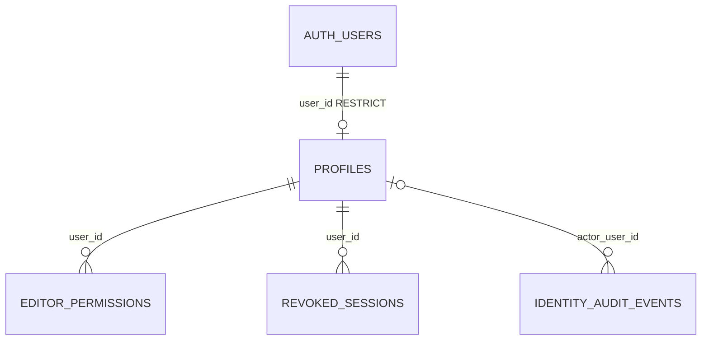
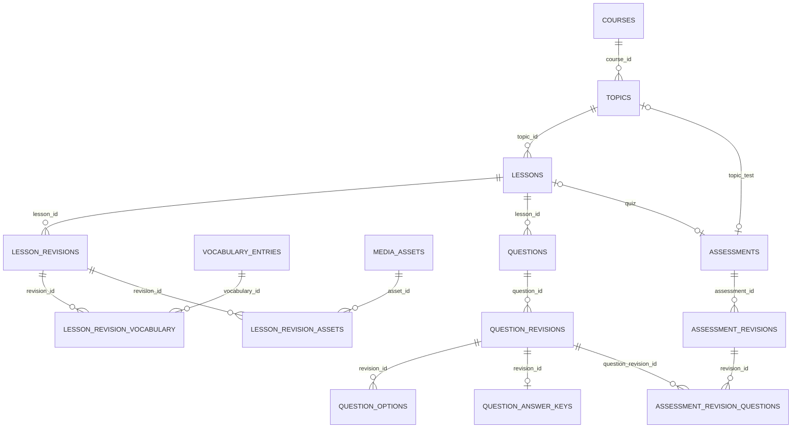
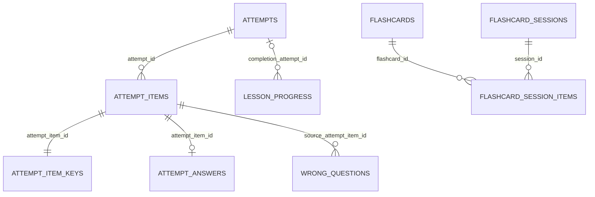

# Thiết kế database MVP web hệ thống tự học tiếng Anh

| Thuộc tính | Giá trị |
|---|---|
| Phiên bản | 1.3 |
| Ngày lập | 19/09/2026 |
| Trạng thái | Đã triển khai database local bằng 15 migration và tích hợp ba HTTP service; xem database-verification.md và backend-verification.md |
| Phạm vi | Database cho Web người học và Web Admin; không thêm chức năng ngoài MVP |
| Căn cứ | [SRS 0.5](../srs.md), [Kế hoạch web 1.3](../web-mvp-plan.md) |
| Môi trường | Supabase local qua CLI/Docker khi phát triển; Supabase Cloud khi deploy; cùng lịch sử migration |

Thiết kế gồm **38 bảng nghiệp vụ: 4 Identity, 18 Content và 16 Learning**, chưa tính bảng do Supabase quản lý. Database local đã được dựng từ migration, có bootstrap và kiểm thử tích hợp. [Kết quả database](database-verification.md) và [kết quả backend](backend-verification.md) phân biệt phần đã chạy với Google/Cloud còn cần triển khai; [hướng dẫn local](local-development.md) mô tả lệnh vận hành.

## 1. Quyền sở hữu và quy ước

### 1.1. Ranh giới dữ liệu

| Schema | Service | Quyền sở hữu |
|---|---|---|
| `identity` | Identity | Hồ sơ, role, quyền Editor, khóa tài khoản, thu hồi phiên và audit tài khoản |
| `content` | Content | Lộ trình, bài, câu hỏi/đáp án, phiên bản nội dung, từ vựng và metadata media |
| `learning` | Learning | Lượt làm, câu trả lời, kết quả, tiến độ, thẻ cá nhân và các hoạt động ôn |
| `auth` | Supabase Auth | Tài khoản, danh tính Google/email, mật khẩu, phiên và token |
| `storage` | Supabase Storage | Bucket và object; thao tác qua API Storage |

- FK vật lý được khai báo trong từng schema nghiệp vụ. Ngoại lệ duy nhất giữa schema nghiệp vụ và schema managed là `identity.profiles.user_id → auth.users.id ON DELETE RESTRICT`.
- UUID người dùng, nội dung và phiên bản đi qua ranh giới service là tham chiếu logic, không phải FK chéo. Service xác thực nguồn qua API trước khi tạo dữ liệu; UUID/đáp án/nội dung nguồn không được tin trực tiếp từ browser.
- Runtime không join bảng service khác. Báo cáo Admin kết hợp kết quả API của Identity, Content và Learning; tiến độ kết hợp dữ liệu Learning với danh mục hiện hành do Content cung cấp.
- Không sao chép mật khẩu, refresh token hoặc tạo bảng `google_accounts`. `email_cached` không là khóa để ghép danh tính. Supabase khuyến nghị tham chiếu khóa chính `auth.users` thay vì các cột/index nội bộ có thể thay đổi. [User Management](https://supabase.com/docs/guides/auth/managing-user-data).

### 1.2. Kiểu dữ liệu và cột chung

Trong từ điển dưới đây, dấu `?` nghĩa là nullable; trường không có dấu này là NOT NULL. Các cột có default được ghi kèm. `PK`, `FK`, `UQ` lần lượt là khóa chính, khóa ngoại, ràng buộc duy nhất.

- Bảng có `id` dùng `uuid DEFAULT gen_random_uuid()`; bảng nối/hồ sơ dùng PK tự nhiên được ghi rõ.
- **M**: cột metadata cho bản ghi có thể sửa gồm `created_at timestamptz DEFAULT now()`, `updated_at timestamptz DEFAULT now()`, `row_version bigint DEFAULT 1 CHECK > 0`. Backend/trigger cập nhật `updated_at` và tăng `row_version` đúng một lần khi có thay đổi.
- **C**: chỉ `created_at timestamptz DEFAULT now()` cho bản ghi append-only/bản chụp. Dữ liệu con của draft vẫn được sửa trước xuất bản; item phiên ôn được chuyển trạng thái một lần như mô tả riêng. Cột thời gian nghiệp vụ riêng không thay thế cột tạo bản ghi.
- `position integer CHECK > 0`; vị trí chỉ bắt buộc duy nhất ở danh sách đã cố định của đề/phiên, không bắt buộc liên tục trong danh mục để dễ đổi thứ tự.
- Thời gian lưu UTC; `activity_date` của báo cáo lấy ngày theo `Asia/Ho_Chi_Minh` từ thời gian server. Khoảng ôn 1 ngày là 24 giờ, không phải lần chuyển ngày lịch.
- `text` + CHECK dùng cho trạng thái; không dùng PostgreSQL enum trong bản đầu. Văn bản bắt buộc không được chỉ chứa khoảng trắng, trừ trường được ghi rõ cho phép rỗng hoặc có default chuỗi rỗng.
- FK mặc định `ON DELETE RESTRICT`. Xóa nháp hợp lệ phải xóa các bản ghi con trong cùng transaction theo thứ tự; không cascade vào lịch sử, audit, bản đã xuất bản hoặc Supabase Auth.
- `jsonb` được kiểm tra kiểu tại database và kiểm tra cấu trúc bằng schema TypeScript tại backend; các ID/quan hệ cần query hoặc constraint được giữ thành cột riêng.

Triển khai SQL bổ sung `creation_xid xid8` trên attempts và flashcard_sessions để chặn thêm snapshot item sau transaction tạo; đây là cột kỹ thuật, không thuộc DTO người học. Các schema TypeScript/HTTP DTO chưa được triển khai trong bước database.

## 2. ERD theo schema

Sơ đồ mô tả các quan hệ vật lý chính; không vẽ UUID tham chiếu logic giữa các service như FK. Các cột con trỏ phiên bản hiện hành và audit được mô tả thêm trong từ điển.

### 2.1. Identity

### 2.2. Content

### 2.3. Learning

`enrollments`, `lesson_favorites`, `lesson_daily_views` và `request_dedup` có khóa người dùng/nội dung hoặc tham chiếu logic; không có FK chéo schema nên không nối chúng vào ERD bằng đường FK giả.

## 3. Từ điển dữ liệu Identity

### 3.1. `identity.profiles`

| Cột | Kiểu/default | Ý nghĩa |
|---|---|---|
| `user_id` | uuid PK, FK auth.users.id RESTRICT | Định danh Supabase đã xác thực |
| `display_name` | text? | 2–50 ký tự khi có; null chỉ khi onboarding chưa hoàn tất |
| `email_cached` | text | Email từ Auth để tìm kiếm, không unique/không là định danh thay thế |
| `role` | text DEFAULT 'learner' | learner, editor, admin |
| `status` | text DEFAULT 'active' | active, locked, disabled |
| `lock_reason` | text? | Lý do quản trị; không trả cho người học qua API thông thường |
| `sessions_revoked_before` | timestamptz? | Chặn phiên được tạo trước hoặc bằng thời điểm này |
| metadata | M | Version phục vụ sửa hồ sơ/trạng thái |

Hồ sơ được upsert bởi Identity sau khi có định danh Auth đáng tin cậy hoặc sau lời mời được tạo bằng Admin API. Onboarding lỗi có thể thử lại cùng `user_id`. Tên Google chỉ gợi ý lúc tạo; không ghi đè tên tự sửa. Tài khoản thiếu tên chỉ được hoàn tất hồ sơ, chưa thực hiện hoạt động học có lưu. Trạng thái xác minh email lấy từ Auth, không suy ra từ `profiles.status` và không tin metadata do người dùng sửa. Danh sách tài khoản chưa có profile/đang chờ xác minh được Identity tổng hợp với Auth Admin API.

### 3.2. `identity.editor_permissions`

`user_id uuid FK profiles`, `permission_code text`, `granted_by uuid FK profiles`, `granted_at timestamptz DEFAULT now()`; PK `(user_id, permission_code)`.

Chỉ chấp nhận `content.write`, `content.publish`, `learners.manage`, `reports.view`. Chủ thể phải đang có role Editor. Khi nâng thành Editor, cấp mặc định `content.write`; khi thu hồi role, xóa các grant trong cùng transaction. Administrator được quyền theo role, không cần dòng grant giả. Người học không có grant. Dùng trigger kiểm tra hoặc hàm thay đổi role/grant cùng transaction để ràng buộc vai trò và grant không lệch nhau.

### 3.3. `identity.revoked_sessions`

`session_id uuid PK`, `user_id uuid FK profiles`, `revoked_at timestamptz DEFAULT now()`, `reason text`.

`session_id` là tham chiếu logic tới phiên Auth, không FK tới `auth.sessions` vì phiên managed có vòng đời riêng. Tạo bản ghi này khi thu hồi một phiên; kiểm tra theo session ID của JWT đã xác thực. Thu hồi toàn bộ phiên dùng thêm mốc trên profile. Identity kiểm tra trạng thái phiên Auth và thời điểm tạo phiên qua giao diện nội bộ giới hạn; không so sánh mốc thu hồi với JWT `iat` mới sau refresh. Không expose bảng phiên Auth hoặc token cho service khác.

### 3.4. `identity.audit_events`

`id uuid PK`, `actor_user_id uuid? FK profiles`, `action text`, `target_user_id uuid? FK profiles`, `changes jsonb DEFAULT '{}'`, metadata C. `actor_user_id = null` biểu thị thao tác hệ thống.

Append-only với runtime; chỉ ghi trường thay đổi phục vụ audit tài khoản/quyền, không ghi token, mật khẩu hoặc callback URL chứa mã bí mật. Thay đổi role/trạng thái được khóa bằng cùng một advisory transaction lock cho nhóm Administrator để kiểm tra không làm mất Administrator hoạt động cuối cùng; ghi audit cùng transaction.

## 4. Từ điển dữ liệu Content

Trạng thái các root `courses`, `topics`, `lessons`, `assessments`: `draft`, `published`, `hidden`. Thêm `first_published_at timestamptz?` cho bốn bảng này để biết nội dung từng xuất bản ngay cả sau khi bị ẩn. Không được xóa root đã có `first_published_at`.

### 4.1. `content.courses`

`id uuid PK`, `title text`, `description text DEFAULT ''`, `objectives text DEFAULT ''`, `level text`, `status text DEFAULT 'draft'`, `position integer`, `catalog_version bigint DEFAULT 1 CHECK > 0`, `first_published_at timestamptz?`, metadata M.

`catalog_version` tăng nguyên tử khi thêm/bớt nội dung đang hiển thị, đổi thứ tự hoặc trạng thái ảnh hưởng danh mục. Sửa câu chữ không tự làm tăng version danh mục. Version dùng để thông báo cho người học khi mẫu số tiến độ đổi, không phải tỷ lệ hoàn thành được lưu sẵn.

### 4.2. `content.topics`

`id uuid PK`, `course_id uuid FK courses`, `title text`, `description text DEFAULT ''`, `objectives text DEFAULT ''`, `status text DEFAULT 'draft'`, `position integer`, `first_published_at timestamptz?`, metadata M.

Một chủ đề thuộc một lộ trình. Sau lần xuất bản đầu không đổi `course_id`; vẫn đổi thứ tự và metadata được. Ẩn cha chỉ đổi khả năng hiển thị hiệu lực, không tự ghi đè trạng thái riêng của các bài con.

### 4.3. `content.lessons`

`id uuid PK`, `topic_id uuid FK topics`, `status text DEFAULT 'draft'`, `position integer`, `is_preview boolean DEFAULT false`, `published_revision_id uuid?`, `first_published_at timestamptz?`, metadata M.

Sau lần xuất bản đầu không đổi `topic_id`. FK kép `(id, published_revision_id) → lesson_revisions(lesson_id, id)` bảo đảm con trỏ không trỏ sang bài khác; cho phép null trước xuất bản. Bảng revision cần unique bổ sung `(lesson_id, id)` để làm đích FK kép. Khi trạng thái published phải có con trỏ tới revision đã xuất bản.

### 4.4. `content.lesson_revisions`

`id uuid PK`, `lesson_id uuid FK lessons`, `revision_no integer CHECK > 0`, `title text`, `objectives text DEFAULT ''`, `blocks jsonb DEFAULT '[]'`, `published_at timestamptz?`, `created_by uuid`, metadata M.

UQ `(lesson_id, revision_no)`; partial UQ `(lesson_id) WHERE published_at IS NULL` cho tối đa một nháp. `created_by` là UUID logic Identity. `blocks` là array các khối có `id` ổn định trong revision và loại `text`, `grammar`, `reading`, `vocabulary`, `audio`:

- Khối chữ có `body`; đọc có `body` và `title` tùy chọn.
- Khối từ vựng có danh sách `vocabulary_ids`, tất cả phải xuất hiện ở `lesson_revision_vocabulary` của revision.
- Khối audio có `asset_id`, `transcript`; asset phải xuất hiện trong `lesson_revision_assets`.

Chưa cho HTML thực thi/script hoặc cấu trúc nhúng tùy ý. Khi xuất bản, kiểm tra nội dung không trống, asset hợp lệ và quiz đủ điều kiện. Payload đã xuất bản và các bảng con của nó bất biến với runtime; sửa tạo revision nháp mới.

### 4.5. `content.vocabulary_entries`

`id uuid PK`, `word text`, `meaning text`, `example text DEFAULT ''`, `phonetic text?`, `audio_asset_id uuid? FK media_assets`, `source text?`, `status text DEFAULT 'active'` (active/hidden), metadata M.

Không unique theo `word`: một từ có thể có nhiều nghĩa. Bài xuất bản không đọc nội dung động từ bảng này mà đọc snapshot bên dưới. Entry từng được bài xuất bản tham chiếu dùng ẩn, không xóa hẳn.

### 4.6. `content.lesson_revision_vocabulary`

`lesson_revision_id uuid FK lesson_revisions`, `vocabulary_id uuid FK vocabulary_entries`, `position integer`, `snapshot jsonb`, metadata C. PK `(lesson_revision_id, vocabulary_id)`; UQ `(lesson_revision_id, position)`.

Snapshot gồm `word`, `meaning`, `example`, `phonetic`, `audio_asset_id` theo phiên bản bài. Mọi audio của snapshot phải được đăng ký trong `lesson_revision_assets`. Nút lưu từ tạo flashcard từ snapshot này, không lấy nội dung mới hơn trong entry chung.

### 4.7. `content.media_assets`

`id uuid PK`, `bucket text`, `object_key text`, `mime_type text`, `size_bytes bigint`, `checksum text`, `source text?`, `status text DEFAULT 'ready'` (ready/unavailable), `uploaded_by uuid`, metadata M.

UQ `(bucket, object_key)`; `0 < size_bytes <= 10485760`; định dạng đã kiểm tra thuộc MP3/M4A (`audio/mpeg`, `audio/mp4`, `audio/x-m4a`). `checksum` là SHA-256 của file, không bắt unique vì hai asset có thể cùng nội dung. Bucket đề xuất `learning-media` là private; backend cấp URL có hạn sau kiểm tra quyền/nội dung. Ghi trạng thái ready sau upload thành công.

Bucket/key/checksum không được đổi để thay nội dung file. File mới tạo asset mới; không lưu URL ký tạm thời vào database. Không xóa asset còn được revision hoặc từ vựng tham chiếu. Trường hợp file thực tế không truy cập được chuyển unavailable và vẫn giữ metadata/lịch sử.

### 4.8. `content.lesson_revision_assets`

`lesson_revision_id uuid FK lesson_revisions`, `asset_id uuid FK media_assets`, metadata C; PK hai cột. Đây là danh sách tham chiếu đầy đủ từ blocks và vocabulary snapshot của bài. Backend đồng bộ danh sách khi lưu nháp và kiểm tra lại khi xuất bản; sau xuất bản không sửa/xóa các dòng.

### 4.9. `content.questions`

`id uuid PK`, `lesson_id uuid FK lessons`, `status text DEFAULT 'active'` (active/hidden/invalid), `first_published_at timestamptz?`, metadata M.

Một câu có định danh ổn định xuyên phiên bản và một bài nguồn; sau khi từng xuất bản không đổi `lesson_id`. `invalid` dùng khi câu có lỗi cần ngừng cấp vào hoạt động mới. Không có con trỏ câu hỏi hiện hành: mỗi phiên bản đề chọn chính xác revision câu cần dùng.

### 4.10. `content.question_revisions`

`id uuid PK`, `question_id uuid FK questions`, `revision_no integer CHECK > 0`, `type text` (single_choice/fill_blank), `prompt text`, `passage text?`, `audio_asset_id uuid? FK media_assets`, `published_at timestamptz?`, `created_by uuid`, metadata M.

UQ `(question_id, revision_no)` và `(question_id, id)`; partial UQ một draft/question. `prompt` bắt buộc khi xuất bản. Nội dung không có đáp án/giải thích/transcript bị hạn chế; các phần đó nằm ở answer key. Question revision chỉ chuyển từ nháp sang bất biến sau khi validation thành công.

### 4.11. `content.question_options`

`question_revision_id uuid FK question_revisions`, `option_key text`, `text text`, `position integer`, metadata C. PK `(question_revision_id, option_key)`; UQ `(question_revision_id, position)`. `option_key` là mã ổn định trong revision, ví dụ A/B/C/D, không dùng chỉ số mảng làm đáp án.

Chỉ dùng cho single_choice; 2–4 lựa chọn khi xuất bản. Chặn lựa chọn trùng nội dung sau chuẩn hóa khoảng trắng và hoa/thường. Bảng có thể được chỉnh khi parent còn nháp; bất biến sau xuất bản.

### 4.12. `content.question_answer_keys`

`question_revision_id uuid PK FK question_revisions`, `correct_option_key text?`, `accepted_answers text[]?`, `explanation text`, `transcript text?`, metadata M.

FK kép `(question_revision_id, correct_option_key) → question_options(question_revision_id, option_key)`. Với single_choice: đúng một mã lựa chọn, accepted_answers null. Với fill_blank: mã lựa chọn null, accepted_answers không rỗng, không có phần tử null/rỗng sau chuẩn hóa; không có dòng question_options. Kiểm tra tương ứng loại câu bằng validation khi xuất bản, không dùng CHECK đọc bảng khác.

Nháp có thể chưa có answer key; xuất bản yêu cầu đúng một key và giải thích không rỗng. Transcript của tư liệu kiểm tra được lưu ở đây và chỉ được trả sau nộp.

### 4.13. `content.assessments`

`id uuid PK`, `kind text` (quiz/topic_test), `lesson_id uuid? FK lessons`, `topic_id uuid? FK topics`, `status text DEFAULT 'draft'`, `published_revision_id uuid?`, `first_published_at timestamptz?`, metadata M.

CHECK phân biệt chủ sở hữu: quiz có lesson_id và topic_id null; topic_test có topic_id và lesson_id null. Partial UQ `lesson_id WHERE kind='quiz'` và `topic_id WHERE kind='topic_test'` áp dụng cả đề ẩn để giữ một định danh đề ổn định/đơn vị học. Con trỏ dùng FK kép `(id, published_revision_id) → assessment_revisions(assessment_id, id)` và phải trỏ tới bản đã xuất bản.

### 4.14. `content.assessment_revisions`

`id uuid PK`, `assessment_id uuid FK assessments`, `revision_no integer CHECK > 0`, `title text`, `passing_percent smallint DEFAULT 70 CHECK BETWEEN 1 AND 100`, `grading_policy_version integer DEFAULT 1 CHECK > 0`, `published_at timestamptz?`, `created_by uuid`, metadata M.

UQ `(assessment_id, revision_no)` và `(assessment_id, id)`; partial UQ một draft/assessment. MVP xuất bản với ngưỡng 70 theo SRS; cột được lưu để lịch sử không phụ thuộc hằng số tương lai. Không thêm bộ hẹn giờ/giới hạn lượt trong bản này.

### 4.15. `content.assessment_revision_questions`

`assessment_revision_id uuid FK assessment_revisions`, `question_id uuid FK questions`, `question_revision_id uuid`, `position integer`, metadata C. PK `(assessment_revision_id, question_id)`; UQ `(assessment_revision_id, position)`; FK kép `(question_id, question_revision_id) → question_revisions(question_id, id)`.

Xuất bản quiz kiểm tra 5–10 câu thuộc đúng bài. Xuất bản topic_test kiểm tra 10–20 câu thuộc bài trong chủ đề; không dùng cùng logical question với quiz của chủ đề. Chặn việc xuất bản một trong hai phía nếu gây trùng mã với phía còn lại; trùng nguyên câu với mã khác được cảnh báo bằng so sánh nội dung và người biên soạn phải rà soát. Revision câu được tham chiếu phải đã xuất bản, logical question active và asset cần dùng khả dụng. Đề đã xuất bản không sửa danh sách/thứ tự câu.

### 4.16. `content.audit_events`

`id uuid PK`, `actor_user_id uuid?`, `action text`, `entity_type text`, `entity_id uuid`, `changes jsonb DEFAULT '{}'`, metadata C. Actor là UUID logic; mục tiêu là tham chiếu audit nên không FK đa hình. Append-only; không sao chép answer key/token/file vào audit. Ghi cùng transaction tạo bản xuất bản/ẩn/thay đổi nội dung.

## 5. Từ điển dữ liệu Learning

`user_id` của các bảng Learning là UUID logic đã được Identity xác thực. Các ID lộ trình/chủ đề/bài/đề/câu/phiên bản/từ vựng/media thuộc Content cũng là tham chiếu logic. Mọi FK ghi trong mục này đều nằm trong Learning.

### 5.1. `learning.enrollments`

`user_id uuid`, `course_id uuid`, `is_active boolean DEFAULT false`, `last_seen_catalog_version bigint DEFAULT 0 CHECK >= 0`, `enrolled_at timestamptz DEFAULT now()`, metadata M. PK `(user_id, course_id)`; partial UQ `(user_id) WHERE is_active`.

Chọn lộ trình khóa thao tác theo người, bỏ active của lộ trình cũ rồi upsert lộ trình mới trong một transaction. Không xóa enrollment cũ. `last_seen_catalog_version` cập nhật khi người học đã nhận thông báo/danh mục mới, không tự cập nhật nền làm mất thông báo thay đổi tiến độ.

### 5.2. `learning.lesson_progress`

`user_id uuid`, `lesson_id uuid`, `first_opened_at timestamptz`, `last_opened_at timestamptz`, `completed_at timestamptz?`, `completion_attempt_id uuid? FK attempts`, metadata M. PK `(user_id, lesson_id)`.

Không có hàng nghĩa là chưa học; có hàng và completed_at null là đang học. Completed_at và completion_attempt_id cùng null hoặc cùng có giá trị. Lượt hoàn thành phải là quiz đã submitted, passed, cùng user và cùng lesson; kiểm tra bằng deferred constraint trigger trong Learning. Hai trường này ghi nhận lần đạt đầu tiên và không bị lượt điểm thấp hơn ghi đè. `last_opened_at >= first_opened_at`.

### 5.3. `learning.lesson_favorites`

`user_id uuid`, `lesson_id uuid`, metadata C; PK hai cột. Lưu dùng upsert không đổi created_at khi lặp; bỏ lưu được xóa hàng. Bài ẩn vẫn có thể còn favorite nhưng API trả trạng thái không khả dụng.

### 5.4. `learning.lesson_daily_views`

`user_id uuid`, `lesson_id uuid`, `activity_date date`, metadata C; PK ba cột. Chỉ ghi lượt mở thành công của người có đăng nhập; cùng người/bài/ngày dùng INSERT ON CONFLICT DO NOTHING. Báo cáo một khoảng ngày đếm DISTINCT user_id trên tập ngày, không cộng bộ đếm người riêng từng ngày thành người duy nhất toàn kỳ.

### 5.5. `learning.attempts`

| Cột | Kiểu/default | Quy tắc |
|---|---|---|
| `id`, `user_id` | uuid PK; uuid | Người sở hữu lấy từ phiên đã xác thực |
| `kind` | text | quiz, topic_test, mistake_review |
| `assessment_id`, `assessment_revision_id` | uuid? | Có với quiz/test; đều null với mistake_review |
| `course_id`, `topic_id`, `lesson_id` | uuid? | Quiz có đủ ba; test có course/topic, lesson null; review để null vì có thể trộn chủ đề |
| `title_snapshot` | text | Tên tại lúc bắt đầu, không phụ thuộc tên nội dung hiện hành |
| `status` | text DEFAULT 'in_progress' | in_progress, submitted, cancelled |
| `passing_percent` | smallint? | Snapshot 70 cho quiz/test; null cho review |
| `grading_policy_version` | integer DEFAULT 1 CHECK > 0 | Cách chấm/chuẩn hóa áp dụng cho lượt, giữ ổn định |
| `total_count` | integer CHECK > 0 | Số item cố định lúc bắt đầu |
| `correct_count`, `passed` | integer?; boolean? | Chỉ có correct_count khi submitted; passed chỉ có với quiz/test submitted |
| `started_at` | timestamptz DEFAULT now() | Bắt đầu lượt |
| `submitted_at`, `cancelled_at`, `cancel_reason` | timestamptz?; timestamptz?; text? | Đồng bộ với trạng thái kết thúc |
| metadata | M | Kiểm soát cập nhật đồng thời |

CHECK trạng thái: in_progress không có mốc kết thúc/kết quả; submitted có submitted_at và correct_count NOT NULL trong `[0,total_count]`, không có cancelled_at/cancel_reason; cancelled có cancelled_at/lý do, không có submitted_at, correct_count hoặc passed. Quiz/test luôn có passing_percent trong 1–100 và có passed NOT NULL khi submitted; review luôn có passing_percent/passed null. Với submitted quiz/test: `passed = (100 * correct_count >= passing_percent * total_count)`; không lưu điểm float đã làm tròn. Các nhánh CHECK dùng IS NULL/IS NOT NULL rõ ràng, không để biểu thức so sánh trả null vô tình chấp nhận trạng thái thiếu dữ liệu.

Partial UQ `(user_id, assessment_id) WHERE status='in_progress' AND kind IN ('quiz','topic_test')`; partial UQ `(user_id) WHERE status='in_progress' AND kind='mistake_review'`. Số câu: quiz 5–10, topic_test 10–20, mistake_review 1–10; số item thực phải bằng total_count khi transaction tạo lượt commit. Một lượt terminal không nhận thêm sửa/nộp mới; replay thao tác đã nộp đọc lại kết quả đã có.

### 5.6. `learning.attempt_items`

`id uuid PK`, `attempt_id uuid FK attempts`, `question_id uuid`, `question_revision_id uuid`, `lesson_id uuid`, `position integer`, `public_snapshot jsonb`, `mistake_generation bigint?`, metadata C.

UQ `(attempt_id, position)` và `(attempt_id, question_id)`. Public snapshot gồm `type`, `prompt`, `options` nếu có, `passage`, `audio_asset_id` nếu có, `lesson_title`, `topic_id`, `topic_title` để giữ liên kết/gợi ý và lịch sử. Không có đáp án/giải thích/transcript hạn chế trong snapshot này. `mistake_generation` bắt buộc và >0 cho review, null cho quiz/test. Snapshot và thứ tự bất biến ngay khi tạo lượt.

### 5.7. `learning.attempt_item_keys`

`attempt_item_id uuid PK FK attempt_items`, `answer_snapshot jsonb`, `explanation_snapshot text`, `transcript_snapshot text?`, metadata C.

Single choice lưu `{ "type": "single_choice", "correct_option_key": "A" }`; điền từ lưu `{ "type": "fill_blank", "accepted_answers": ["good morning"] }`. Type phải khớp public_snapshot; đúng một key/item tại commit tạo lượt. Chỉ nhận từ API nội bộ Content hoặc bản chụp lượt sai nguồn; bất biến và không xuất trực tiếp qua API người học.

### 5.8. `learning.attempt_answers`

`attempt_item_id uuid PK FK attempt_items`, `answer jsonb`, `is_correct boolean?`, `answered_at timestamptz`, `checked_at timestamptz?`, metadata M.

Single choice nhận `{ "option_key": "A" }`; fill_blank nhận `{ "text": "Good morning" }`; `{}` biểu thị bỏ trống khi kết thúc lượt. Chỉ dùng mã lựa chọn tồn tại trong public_snapshot. Quiz/review: lần kiểm tra đầu tiên ghi is_correct và checked_at, sau đó không sửa câu đó. Test: cho thay answer trước nộp, is_correct/checked_at vẫn null; khi nộp chấm toàn bài rồi khóa.

Kết thúc quiz/test tạo answer `{}` với is_correct=false cho câu chưa trả lời; không thay lần kiểm tra đầu tiên của câu quiz đã trả lời. Lượt hủy giữ những answer đã lưu nhưng không sinh điểm tổng/câu sai mới. `expectedVersion` của update so với row_version; lần tạo đầu dùng giá trị 0 theo hợp đồng API. Thiếu hàng không được hiểu là câu đúng.

### 5.9. `learning.wrong_questions`

`user_id uuid`, `question_id uuid`, `source_attempt_item_id uuid FK attempt_items`, `generation bigint DEFAULT 1 CHECK > 0`, `status text DEFAULT 'pending'` (pending/resolved/suppressed), `last_failed_at timestamptz`, `resolved_at timestamptz?`, `suppressed_reason text?`, metadata M. PK `(user_id, question_id)`.

Nguồn phải thuộc một quiz/test submitted, cùng user/question và answer sai, kiểm tra bằng constraint trigger trì hoãn đến cuối transaction. Mỗi lần sai mới tăng generation và cập nhật source, last_failed_at, status=pending; không tạo hàng thứ hai. Chỉ lượt review đúng với generation còn khớp mới chuyển resolved. Suppressed dùng cho nội dung ẩn/invalid, có lý do và không có resolved_at. Nội dung được mở lại không tự chuyển suppressed thành đã ôn đúng; một lần sai mới có thể đưa về pending.

Review sai không tạo generation mới; giữ trạng thái pending và last_failed_at của lần sai quiz/test. Trả lời đúng ở quiz/test khác không tự giải quyết hàng này. Filter theo chủ đề lấy topic_id trong public_snapshot của source item.

### 5.10. `learning.flashcards`

| Cột | Kiểu/default | Ý nghĩa |
|---|---|---|
| `id`, `user_id` | uuid PK; uuid | Chủ sở hữu |
| `source_vocabulary_id` | uuid? | Null nếu tạo thủ công |
| `source_lesson_id`, `source_topic_id`, `source_course_id` | uuid? | Nguồn lúc lưu từ bài; thẻ thủ công để null |
| `word`, `meaning`, `example` | text; text; text DEFAULT '' | Bản sao cá nhân, word/meaning không rỗng |
| `phonetic`, `audio_asset_id` | text?; uuid? | Dữ liệu phát âm nếu có |
| `stage` | smallint DEFAULT 0 CHECK BETWEEN 0 AND 4 | Bậc ôn |
| `due_at` | timestamptz DEFAULT now() | Đến hạn ngay lúc tạo/reset |
| `last_reviewed_at` | timestamptz? | Null là thẻ mới kể từ lần reset gần nhất |
| `reset_generation` | bigint DEFAULT 1 CHECK > 0 | Tăng khi reset hoặc khôi phục thẻ |
| `deleted_at` | timestamptz? | Xóa mềm |
| metadata | M | Đồng thời khi sửa thẻ |

UQ `(user_id, source_vocabulary_id)` áp dụng cả thẻ deleted; nhiều thẻ thủ công có source null được phép. Cột nguồn của thẻ lấy từ bài được lưu đầy đủ cùng nhau; chúng không bị sửa khi người dùng sửa bản sao cá nhân. Thẻ chỉ tạo thủ công từ/ nghĩa/ví dụ, chưa upload audio cá nhân.

Sửa word hoặc meaning: tăng reset_generation, stage=0, last_reviewed_at=null, due_at=thời gian server; không xóa lịch sử. Sửa ví dụ không reset. Khôi phục thẻ nguồn giữ bản sao cá nhân gần nhất, xóa deleted_at và reset lịch; không tự ghi đè bằng từ vựng mới từ Content. Thẻ stage=0 nhưng last_reviewed_at khác null là đã ôn Chưa nhớ, không thuộc bộ đếm thẻ mới.

### 5.11. `learning.flashcard_sessions`

`id uuid PK`, `user_id uuid`, `status text DEFAULT 'in_progress'` (in_progress/completed/cancelled), `started_at timestamptz DEFAULT now()`, `finished_at timestamptz?`, metadata M. UQ `(user_id, id)` hỗ trợ FK xác nhận chủ sở hữu; partial UQ `(user_id) WHERE status='in_progress'`.

Phiên 1–20 item; danh sách cố định khi bắt đầu. Chọn thẻ đã học đến hạn theo due_at cũ nhất, rồi thẻ mới theo created_at; không cấp thẻ chưa đến hạn. Thoát màn hình giữ in_progress để tiếp tục; cancelled chỉ qua hành động hủy rõ ràng. Completed khi tất cả item đã reviewed hoặc skipped. Terminal có finished_at, in_progress không có finished_at.

### 5.12. `learning.flashcard_session_items`

`id uuid PK`, `session_id uuid`, `flashcard_id uuid`, `user_id uuid`, `position integer`, `reset_generation bigint`, `card_snapshot jsonb`, `status text DEFAULT 'pending'` (pending/reviewed/skipped), `rating text?` (remember/again), `reviewed_at timestamptz?`, `stage_before smallint?`, `stage_after smallint?`, `due_before timestamptz?`, `due_after timestamptz?`, `skip_reason text?`, metadata C.

FK kép `(user_id, session_id) → flashcard_sessions(user_id, id)` và `(user_id, flashcard_id) → flashcards(user_id, id)`; thêm UQ `(user_id, id)` trên flashcards. UQ `(session_id, flashcard_id)` và `(session_id, position)`. Snapshot gồm word/meaning/example/phonetic/audio_asset_id lúc bắt đầu.

Pending chưa có rating/mốc đánh giá/kết quả trước-sau/lý do bỏ qua. Reviewed có rating, reviewed_at và đầy đủ stage/due trước-sau, không có skip_reason. Skipped có skip_reason, không có rating/kết quả đánh giá. Item reviewed/skipped bất biến; thay đổi pending sang terminal chỉ một lần. Bảng này đồng thời là lịch sử đánh giá, không thêm bảng flashcard_reviews trùng dữ liệu.

### 5.13. `learning.request_dedup`

`user_id uuid`, `operation text`, `idempotency_key uuid`, `request_hash text`, `result_reference jsonb?`, metadata C. PK `(user_id, operation, idempotency_key)`.

Operation là mã hành động ổn định, ví dụ `attempt.start`, `attempt.submit`, `answer.check`, `flashcard.rate`, không phải URL tùy ý. Hash SHA-256 của payload chuẩn hóa gồm target ID và expectedVersion; thay key order JSON không đổi hash. Result chứa loại tài nguyên, ID và outcome/version cần để đọc lại kết quả bất biến, không lưu token hoặc URL tự do từ client.

Cho result_reference null trong transaction lúc claim key; deferred constraint kiểm tra trước commit phải có kết quả. Chỉ lưu thao tác thành công cùng transaction nghiệp vụ; lỗi rollback cả claim. Cùng key/hash trả kết quả cũ; cùng key khác hash trả lỗi xung đột. Quyền hiện tại vẫn phải được kiểm tra trước replay. Trong MVP giữ các key cùng vòng đời lịch sử; chưa thêm tác vụ tự xóa có thể làm mất bảo vệ retry.

## 6. Ràng buộc và bảo vệ lịch sử

### 6.1. Chọn cơ chế kiểm tra

| Điều kiện | Cơ chế database | Trách nhiệm service |
|---|---|---|
| Kiểu, trạng thái, khoảng số, null theo trạng thái | NOT NULL, CHECK trên cùng hàng | Trả lỗi trường nhập dễ hiểu |
| Cha/con cùng schema, con trỏ đúng cha | FK đơn/kép tới PK hoặc UQ | Không nhận ID cha mới cho nội dung đã xuất bản |
| Một bản nháp/lượt đang làm/phiên đang mở | Partial unique index | Khi hai yêu cầu cạnh tranh, đọc lại bản hiện có |
| Số câu, key đầy đủ, loại câu khớp key, số item khớp total_count | Hàm kiểm tra và constraint trigger cuối transaction tại điểm tạo/xuất bản/nộp | Dựng toàn bộ cấu trúc trong một transaction |
| Phiên bản xuất bản, snapshot và kết quả terminal bất biến | Trigger chặn UPDATE/DELETE; không cấp DELETE khi không cần | Sửa bằng revision mới hoặc tạo lượt mới |
| ID thuộc service khác, khả năng truy cập, quyền người dùng | Không tạo FK/truy vấn chéo schema | API nội bộ có xác thực; kiểm tra người sở hữu |

CHECK không được dùng để giả lập kiểm tra dữ liệu ở hàng/bảng khác. Các điều kiện đó cần FK, unique hoặc trigger với khóa phù hợp. [PostgreSQL constraints](https://www.postgresql.org/docs/current/ddl-constraints.html).

Một bảng bật RLS mà chưa có policy cho role sẽ mặc định từ chối truy cập hàng; quyền schema/bảng và policy đều phải được cấp đúng. RLS không thay thế trigger bảo vệ lịch sử, không tự xác minh người dùng cuối của kết nối backend. [Supabase RLS](https://supabase.com/docs/guides/database/postgres/row-level-security).

### 6.2. Xuất bản và thay đổi danh mục

1. MVP hiện dùng advisory transaction lock chung cho các lệnh ghi Content, cùng khóa cha khi sửa revision con. Cách này tuần tự hóa các thao tác CMS để tránh thêm option đúng lúc transaction khác xuất bản; khi cần tăng quy mô, đo contention trước khi tách khóa theo course và thứ tự ID ổn định.
2. Kiểm tra quyền `content.publish`, expectedVersion, quan hệ cha, trường bắt buộc, block, từ vựng, asset, câu hỏi và bộ đáp án. Quiz 5–10 câu cùng bài; test 10–20 câu thuộc các bài đang xuất bản trong cùng chủ đề. Chặn câu hỏi trùng giữa quiz và test theo question_id ở các phiên bản hiện hành; kiểm tra cả hai chiều xuất bản.
3. Đặt published_at cho các revision mới; đánh dấu first_published_at lần đầu trên nội dung gốc. Sau đó cập nhật published_revision_id. Con trỏ khác null luôn phải trỏ tới revision cùng cha và có published_at; trạng thái published bắt buộc có con trỏ. Chuyển sang hidden giữ nguyên con trỏ và lịch sử.
4. Bài và quiz kèm theo phải có phiên bản hợp lệ khi commit; xuất bản đồng thời nếu đang sửa cả hai. Một transaction có thể xuất bản các bài hợp lệ trước rồi bật topic/course; course/topic published cần ít nhất một nội dung con xuất bản hợp lệ. Ẩn cha chỉ thay tính khả dụng, không đổi trạng thái từng con.
5. Tăng catalog_version của course nếu thêm/bớt nội dung đang hiển thị, đổi thứ tự, xuất bản lần đầu hoặc ẩn/khôi phục. Chỉ sửa câu chữ/đáp án bằng revision mới không làm đổi mẫu số tiến độ.
6. Ghi audit rồi commit. Khi có lỗi, toàn bộ revision/con trỏ/audit của lần xuất bản rollback.

`published_at` chỉ được chuyển null → thời gian một lần; không được đặt lại null. Trigger trên revision và các bảng con kiểm tra trạng thái cha, chặn cả sửa/xóa lẫn thêm liên kết vào revision đã xuất bản. Lần xuất bản mới không xóa các revision cũ. Không đổi course_id của topic, topic_id của lesson hoặc lesson_id của question đã từng xuất bản, kể cả khi đang hidden.

`first_published_at` cũng chỉ được thiết lập một lần, không được xóa để biến nội dung cũ thành draft có thể xóa. Không xóa question từng xuất bản; kind và các cột chủ sở hữu của assessment đã xuất bản không được đổi. Trigger kiểm tra cấu trúc nhiều hàng lấy khóa cha và chạy lại trên mọi bảng liên quan khi có thay đổi; không chỉ kiểm tra ở endpoint xuất bản rồi để đường DML khác bỏ qua.

Object key, checksum và nội dung file của media bất biến. Storage chỉ cho backend upload bằng key mới, không upsert ghi đè; xóa file cần kiểm tra tham chiếu qua API của cả Content và Learning. MVP chưa có tác vụ tự dọn media lịch sử. Thay trạng thái unavailable không xóa metadata; client vẫn hiển thị được phần chữ và lịch sử.

### 6.3. Lịch sử học

- Các trường định danh, nguồn, snapshot, chính sách chấm và total_count của attempts/attempt_items/attempt_item_keys cố định ngay sau transaction tạo lượt. Không bổ sung/bớt item của lượt đã tạo; kiểm tra tổng số và đúng một key/item tại commit.
- Khi attempts chuyển submitted/cancelled, không sửa header, answers, items hoặc keys. Khi in_progress, answer chỉ sửa nếu chưa checked; các lần lưu/kiểm tra câu khóa cả attempt trước khi cập nhật answer.
- `lesson_progress.completed_at` và completion_attempt_id ghi lần đạt đầu tiên. Các lần sau chỉ cập nhật thời điểm mở bài; không gỡ hoàn thành vì làm lại thấp điểm hoặc thay revision.
- Lịch sử flashcard lấy card_snapshot và stage/due của session item; chỉnh nội dung thẻ không thay lịch sử đã đánh giá. Phiên kết thúc và item terminal bất biến.
- Bảng audit chỉ INSERT/SELECT; runtime không có UPDATE, DELETE, TRUNCATE. Migration quản trị không phải đường ghi nghiệp vụ và phải được rà soát nếu chạm dữ liệu lịch sử.

## 7. Giao dịch và hợp đồng API

### 7.1. Quy tắc chung

- Backend lấy user_id từ phiên đã được Identity xác minh; không tin user_id, điểm, đáp án đúng, stage hoặc due_at do client gửi. Truy vấn cá nhân luôn giới hạn theo chủ sở hữu, gồm cả truy vấn item qua bảng cha.
- Lệnh tạo lượt, kiểm tra câu, nộp bài và đánh giá thẻ nhận `Idempotency-Key`. Claim bằng INSERT vào request_dedup trong cùng transaction; xung đột unique đợi transaction đầu kết thúc rồi so request_hash. Không dùng mẫu SELECT-trước-rồi-INSERT không có ràng buộc.
- Cùng key/cùng hash đọc lại result_reference, không thực hiện mutation lần hai. Nếu tài nguyên được tạo đã tiến triển, trả ID và trạng thái hiện tại của tài nguyên đó; không tạo lượt khác. Khác hash trả HTTP 409 với mã `IDEMPOTENCY_CONFLICT`.
- Update nhận expectedVersion. UPDATE có điều kiện row_version; không khớp trả HTTP 409 `VERSION_CONFLICT` và yêu cầu tải lại. Quy tắc này dùng cho câu trả lời, thẻ, draft và trạng thái lượt; không nhận version mới do client tự quyết định.
- Thao tác lưu đáp án/kiểm tra câu tăng row_version của attempt trong cùng transaction. Nộp bài kiểm tra attempt version để không bỏ qua đáp án vừa được thiết bị khác lưu. Dữ liệu trả về gồm version mới cần cho lần ghi tiếp theo.
- Lấy thời gian server một lần cho thao tác và dùng thống nhất cho chấm điểm, lịch ôn, audit. Không dùng đồng hồ trình duyệt để quyết định kết quả.
- Thứ tự khóa Learning: khóa giao dịch theo user khi cần tạo/đổi hoạt động → attempt/session → item/answer → card/wrong_question theo ID tăng dần. Mọi đường ghi cùng loại tuân thủ thứ tự này. Không giữ khóa database khi gọi HTTP sang service khác.

Kiểm tra Identity và Content thực hiện trước transaction Learning. Đối với thao tác mở/tiếp tục/lưu/nộp trên nội dung, Content trả tính khả dụng của cha, câu hỏi và revision đang dùng; phiên bản cũ được dùng nếu nội dung vẫn hợp lệ. Đây là kiểm tra tại từng yêu cầu, không phải transaction phân tán với Content. Nếu nội dung bị ẩn đồng thời sau lần kiểm tra, yêu cầu đang xử lý có thể hoàn tất; yêu cầu tiếp theo phải chặn. Không dùng cache quyền hoặc cache khả dụng dài hạn làm trì hoãn khóa tài khoản/ẩn bài.

Khi phát hiện nội dung của lượt dở không còn khả dụng, ghi cancelled cùng lý do bằng transaction riêng được kiểm soát, giữ snapshot/answer đã lưu; không sinh điểm hoặc câu sai mới từ việc hủy. Với ôn câu sai, chuyển các mục không hợp lệ sang suppressed, giữ lịch sử và các mục đã giải quyết trước đó. Lịch sử đã hoàn tất vẫn xem được qua DTO lịch sử, có nhãn nội dung không còn khả dụng.

### 7.2. Bắt đầu hoặc tiếp tục hoạt động

**Quiz/test:** Content cung cấp assessment revision, câu hỏi, key và thông tin bài/chủ đề qua API nội bộ. Learning kiểm tra chủ sở hữu; test yêu cầu đã mở ít nhất một bài trong chủ đề. Trong transaction: claim key, khóa user cho thao tác tạo, đọc lượt đang mở; nếu có thì trả lại lượt đó, nếu chưa có thì tạo attempt, items và keys. Partial unique index là lớp bảo vệ cuối nếu hai thiết bị dùng hai key khác nhau. Tạo lượt và snapshot phải commit cùng nhau.

**Ôn câu sai:** lấy tối đa 10 hàng pending theo last_failed_at cũ nhất, có lọc chủ đề nếu cần. Xác minh khả dụng qua Content; khi tạo lượt khóa và kiểm tra lại source/generation của danh sách đã chọn, thay đổi thì chọn lại. Sao chép public/key từ source_attempt_item_id, không lấy đáp án mới nhất thay thế. Lưu mistake_generation. Danh sách rỗng trả trạng thái không có câu cần ôn; không tạo attempt total_count=0.

**Ôn thẻ:** dưới khóa user, trả lại phiên đang mở hoặc chọn tối đa 20 thẻ chưa xóa theo thứ tự ở mục 5.11. Khóa thẻ được chọn, đọc lại due/reset_generation trước khi tạo items. Danh sách không còn thẻ trả trạng thái trống. Thoát UI không tự kết thúc phiên.

### 7.3. Kiểm tra câu và nộp quiz/test

Kiểm tra từng câu quiz/review: claim key → khóa attempt và answer → kiểm tra owner/status/version → chuẩn hóa và chấm bằng key snapshot → ghi answer checked → cập nhật attempt version → lưu kết quả dedup → commit. Câu quiz checked không được đổi đáp án bằng key mới.

Chuẩn hóa điền từ của grading_policy_version=1: Unicode NFC, trim hai đầu, gộp chuỗi khoảng trắng thành một dấu cách, chuyển chữ thường; áp dụng giống nhau cho input và accepted_answers. Không tự bỏ dấu câu hoặc suy luận đồng nghĩa. Chính sách mới có version mới; lượt cũ tiếp tục dùng hàm chấm tương ứng version đã lưu.

Nộp quiz/test trong **một transaction Learning**:

1. Claim request_dedup; khóa attempt; kiểm tra owner, in_progress và expectedVersion. Retry cùng key được xử lý trước kiểm tra version nghiệp vụ; thao tác cũ đã thành công không bị xem là ghi mới.
2. Với test, chấm tất cả answer đã lưu bằng attempt_item_keys. Với quiz, giữ kết quả checked; tạo answer rỗng/sai cho câu chưa checked. Số câu trống phải được client xác nhận theo SRS nhưng server vẫn tự đếm.
3. Ghi correct_count, passed và submitted_at, status=submitted. Điểm hiển thị làm tròn một chữ số thập phân; passed dùng `100 * correct_count >= passing_percent * total_count`.
4. Nếu quiz đạt, upsert lesson_progress và chỉ thiết lập hoàn thành nếu chưa có. Không ghi hoàn thành bài từ topic_test hoặc mistake_review.
5. Khóa/upsert wrong_questions cho các câu sai theo thứ tự question_id: bản ghi mới generation=1; đã có thì generation+1, cập nhật nguồn và pending. Câu đúng không tự xóa pending.
6. Lưu result_reference trỏ kết quả rồi commit. Lỗi giữa bước nào cũng rollback toàn bộ; không có điểm đã lưu nhưng tiến độ/câu sai chưa lưu.

Hai lần nộp khác key vẫn chỉ có một lần chuyển trạng thái: lần sau đọc lượt submitted và trả trạng thái đã nộp, không chạy lại bước cập nhật tiến độ/câu sai. Nộp và lưu đáp án đồng thời được tuần tự hóa bằng khóa attempt; nếu version đã thay đổi thì bên đến sau nhận xung đột phù hợp.

### 7.4. Giải quyết câu sai

Trong transaction kiểm tra câu của mistake_review, sau khi khóa attempt/item: nếu đáp án đúng, khóa wrong_questions và chỉ UPDATE khi status=pending **và** generation=mistake_generation đã chụp. Khớp thì resolved, ghi resolved_at; không khớp thì giữ nguyên mục sai mới và trả cờ danh sách đã thay đổi. Sai giữ nguyên pending, không tăng generation. Không cập nhật điểm/tiến độ của lượt nguồn.

Khi mọi câu của lượt review đã checked, chuyển submitted; correct_count là số câu đúng của lượt ôn, passing_percent/passed luôn null. Review không có phần trăm điểm hoặc Đạt/Chưa đạt, không tính vào thống kê quiz/test. Hủy lượt dở giữ các câu đã checked và các mục đã resolved, không xử lý các câu chưa làm.

### 7.5. Đánh giá thẻ

1. Claim key, khóa session → item → flashcard; kiểm tra user, phiên đang mở và item pending. UI chỉ cho đánh giá sau lật thẻ; server chỉ chấp nhận rating remember/again trong phiên hợp lệ.
2. Nếu deleted_at khác null hoặc reset_generation khác snapshot: đặt item skipped với lý do `card_deleted`/`card_reset`, không thay lịch thẻ.
3. Nếu hợp lệ: chụp stage/due hiện tại, tính lịch theo bảng dưới, cập nhật thẻ và ghi item reviewed cùng rating, reviewed_at, stage/due trước-sau.
4. Nếu không còn item pending thì session completed/finished_at. Ghi result_reference rồi commit.

| Bậc trước | remember → bậc sau / khoảng từ lúc lưu | again → bậc sau / khoảng từ lúc lưu |
|---|---|---|
| 0 | 1 / 24 giờ | 0 / 24 giờ |
| 1 | 2 / 72 giờ | 0 / 24 giờ |
| 2 | 3 / 168 giờ | 0 / 24 giờ |
| 3 | 4 / 336 giờ | 0 / 24 giờ |
| 4 | 4 / 336 giờ | 0 / 24 giờ |

Khóa item và trạng thái terminal ngăn tăng bậc hai lần kể cả hai key khác nhau; key cũ replay kết quả, key mới trên item đã đánh giá trả xung đột và trạng thái mới nhất. Endpoint sửa/xóa/khôi phục thẻ chỉ khóa thẻ; không khóa ngược session sau khi giữ khóa thẻ. Khi tiếp tục phiên, xử lý item pending có generation cũ/xóa theo cùng thứ tự session → item → card. Khôi phục/reset tăng generation trong cùng transaction sửa thẻ nên lần ôn cũ không thể cập nhật lịch mới.

### 7.6. DTO và thời điểm lộ đáp án

| Đường đọc | Dữ liệu được trả |
|---|---|
| Khách/học liệu | Nội dung đã xuất bản được phép xem; transcript của khối bài học được xem tự do |
| Quiz/review đang làm, câu chưa checked | public_snapshot, câu trả lời đã lưu và version; không key/giải thích/transcript hạn chế |
| Quiz/review đã checked | Thêm phản hồi và key/giải thích của đúng câu đó |
| Topic test đang làm | Câu hỏi và câu trả lời đã lưu; không key/giải thích/transcript của toàn đề |
| Quiz/test đã submitted | Kết quả và phản hồi từng câu, gồm câu bỏ trống |
| Lượt cancelled | Trạng thái và dữ liệu đã được phép xem trước khi hủy; không mở thêm key, đặc biệt test hủy không lộ đáp án |
| API nội bộ Content → Learning | Revision bất biến và key cần tạo snapshot, chỉ cho service đã xác thực |

Không serialize trực tiếp hàng database, không dùng `SELECT *` làm response. Tư liệu test phải độc lập với transcript public trong bài; kiểm tra biên soạn và response thực tế, không chỉ kiểm tra việc ẩn nút trên UI. URL audio ký ngắn hạn được tạo theo quyền tại lúc đọc; không lưu URL tạm trong snapshot. Log request/response cũng phải loại key, token và transcript đang bị hạn chế.

## 8. Quyền database và phiên đăng nhập

### 8.1. Ma trận runtime

| Role | Quyền schema nghiệp vụ | Giới hạn |
|---|---|---|
| `app_identity_runtime` | USAGE và quyền nghiệp vụ cần thiết trong identity | Không đọc Content/Learning; không tự cấp role database |
| `app_content_runtime` | USAGE và quyền nghiệp vụ cần thiết trong content | Không đọc Identity/Learning; nhận quyền người dùng qua Identity |
| `app_learning_runtime` | USAGE và quyền nghiệp vụ cần thiết trong learning | Không đọc Identity/Content; nhận nội dung/key qua API nội bộ |
| `anon`, `authenticated` | Không USAGE, không quyền bảng/hàm của ba schema | Trình duyệt dùng API ứng dụng cho dữ liệu nghiệp vụ |
| Tài khoản migration | DDL và cấp quyền theo triển khai | Chỉ CI/quản trị được dùng; không nằm trong cấu hình runtime/web |

Migration tạo role ứng dụng không có SUPERUSER, CREATEDB, CREATEROLE hoặc BYPASSRLS; không sở hữu schema/bảng và không là thành viên role quản trị hay role service khác. Ban đầu tạo NOLOGIN; bước provision an toàn theo môi trường mới bật LOGIN và đặt mật khẩu từ secret. Không commit mật khẩu hoặc in connection string trong log.

Thu hồi quyền của PUBLIC, anon, authenticated trên schema/bảng/hàm nghiệp vụ và thiết lập default privileges cho **đúng role tạo object migration**. Không expose identity/content/learning trong Data API. Chỉ cấp DML theo nhu cầu từng bảng; cấm TRUNCATE và quyền DDL cho runtime. Audit và snapshot cố định trong attempt_items/attempt_item_keys chỉ INSERT/SELECT; revision và item có chuyển trạng thái dùng trigger để giới hạn trạng thái và trường được sửa.

Bật RLS trên mọi bảng nghiệp vụ. Policy chỉ dành cho runtime sở hữu dữ liệu và thao tác được cấp; có thể dùng USING/WITH CHECK true cho role service đó vì service phục vụ nhiều người. Các role còn lại không có policy mặc định được phép. Đây là RLS theo service; **lọc user_id và kiểm tra quyền người dùng cuối vẫn bắt buộc ở backend**. Không dựa vào auth.uid() khi kết nối Postgres trực tiếp chưa thiết lập ngữ cảnh JWT đáng tin cậy.

Các hàm mặc định SECURITY INVOKER. Chỉ dùng SECURITY DEFINER khi thực sự cần quyền hẹp, cố định search_path, gọi tên object kèm schema, thu hồi EXECUTE của PUBLIC và chỉ cấp cho role được phép. Không tạo hàm nhận SQL/schema/table tùy ý. Thử quyền bằng kết nối thực của từng runtime role, không chỉ thử bằng postgres hoặc role chủ bảng.

### 8.2. Hồ sơ Google/email và thu hồi phiên

Identity lấy định danh đã xác minh từ Supabase Auth. Upsert profile theo user_id nên hai callback cùng định danh không tạo hai hồ sơ; không upsert theo email_cached. Supabase Auth xử lý liên kết danh tính theo cấu hình và chính sách của Auth; việc Google/email thực sự dùng chung định danh phải được kiểm thử tích hợp, bao gồm tình huống email chưa xác minh. Backend không tự gộp hai UUID vì trùng email.

Mỗi yêu cầu được bảo vệ phải kiểm tra chữ ký/hạn JWT, user_id và session_id, trạng thái profile, quyền hiện tại, revoked_sessions, sessions_revoked_before và tình trạng phiên Auth. Mốc thu hồi toàn bộ so với **thời điểm tạo phiên Auth**, không phải iat của access token sau refresh. JWT chưa hết hạn không đủ để coi phiên chưa đăng xuất: Supabase mô tả session_id có thể đối chiếu với auth.sessions khi cần thu hồi có hiệu lực ngay. [Supabase sessions](https://supabase.com/docs/guides/auth/sessions).

Thiết kế triển khai chọn một hàm tra cứu hẹp cho Identity, chỉ trả user_id/created_at và tình trạng phiên cần thiết từ auth.sessions theo session_id, không trả token và không cho runtime SELECT cả schema auth. Hàm có owner quản trị, không được gọi từ browser hoặc Content/Learning. Đây là điểm phụ thuộc vào cấu trúc managed cần smoke test với phiên bản local/cloud đã chọn; không thêm FK, sửa bảng, trigger hay dữ liệu trực tiếp vào auth.sessions. Đăng nhập, đăng xuất, reset mật khẩu và quản lý tài khoản vẫn qua Auth API.

Khóa/vô hiệu hóa tài khoản cập nhật profile và mốc thu hồi trong transaction Identity trước khi gọi các thao tác thu hồi bên Auth; nếu Auth API lỗi, lớp chặn ứng dụng vẫn có hiệu lực và có thể thử lại. Mở khóa không xóa mốc thu hồi cũ; người dùng đăng nhập tạo phiên mới. Giữ Auth user và profile bằng RESTRICT, không dùng xóa tài khoản để làm chức năng khóa. Editor/Admin luôn đọc quyền hiện tại, không tin role từ metadata Google hoặc dữ liệu browser.

## 9. Index và truy vấn đọc

### 9.1. Index bắt buộc

PK/UQ ở từ điển dữ liệu đã tạo index tương ứng; không tạo lại index cùng danh sách cột. FK phía tham chiếu cần index riêng nếu chưa có tiền tố phù hợp. Index duy nhất có điều kiện dùng cho giới hạn số bản đang hoạt động. [PostgreSQL partial indexes](https://www.postgresql.org/docs/current/indexes-partial.html).

| Bảng/nhóm | Khóa index hoặc predicate bổ sung | Truy vấn chính |
|---|---|---|
| identity.profiles | `(role, status, user_id)`; expression `lower(email_cached)` | Danh sách tài khoản, tìm email chính xác |
| identity.editor_permissions | `(granted_by)` | Kiểm tra tham chiếu người cấp |
| identity.revoked_sessions | `(user_id, revoked_at DESC)` | Thu hồi và quản trị phiên; kiểm tra session dùng PK |
| identity.audit_events | `(target_user_id, created_at DESC)`; `(actor_user_id, created_at DESC)` | Lịch sử tài khoản/người thao tác |
| content.courses | `(status, position, id)` | Danh mục hiện hành |
| content.topics / lessons | `(course_id, status, position, id)` / `(topic_id, status, position, id)` | Duyệt cây nội dung và thứ tự |
| Các bảng revision | UQ `(parent_id, revision_no)` và partial UQ `(parent_id) WHERE published_at IS NULL` | Danh sách phiên bản, một bản nháp |
| content.questions | `(lesson_id, status, id)` | Biên soạn/kiểm tra khả dụng |
| content.vocabulary_entries / question_revisions | `(audio_asset_id) WHERE audio_asset_id IS NOT NULL` | Truy ngược tham chiếu audio |
| content.lesson_revision_vocabulary | `(vocabulary_id, lesson_revision_id)` | Tìm phiên bản dùng mục từ |
| content.lesson_revision_assets | `(asset_id, lesson_revision_id)` | Truy ngược file; chiều thuận dùng PK |
| content.assessments | Partial UQ `(lesson_id) WHERE kind='quiz'`; `(topic_id) WHERE kind='topic_test'` | Một nội dung đề cho mỗi bài/chủ đề |
| content.assessment_revision_questions | `(question_id, question_revision_id)`; `(question_revision_id)` | Truy ngược đề dùng câu/phiên bản |
| content.audit_events | `(entity_type, entity_id, created_at DESC)` | Lịch sử biên soạn |
| learning.enrollments | Partial UQ `(user_id) WHERE is_active` | Một lộ trình chính |
| learning.lesson_progress | `(user_id, last_opened_at DESC, lesson_id)`; `(completion_attempt_id) WHERE completion_attempt_id IS NOT NULL` | Tiếp tục học và FK kết quả |
| learning.lesson_favorites | `(user_id, created_at DESC, lesson_id)` | Danh sách yêu thích |
| learning.lesson_daily_views | `(activity_date, lesson_id, user_id)` | Người học bài trong khoảng ngày |
| learning.attempts | Partial UQ `(user_id, assessment_id) WHERE status='in_progress' AND kind IN ('quiz','topic_test')` | Chống trùng lượt quiz/test |
| learning.attempts | Partial UQ `(user_id) WHERE status='in_progress' AND kind='mistake_review'` | Một lượt ôn câu sai |
| learning.attempts | `(user_id, started_at DESC, id)`; `(user_id, topic_id, kind, submitted_at DESC) WHERE status='submitted'` | Lịch sử cá nhân và điểm chủ đề |
| learning.attempts | `(submitted_at, kind, user_id) WHERE status='submitted' AND kind IN ('quiz','topic_test')` | Thống kê lượt/điểm/người hoạt động |
| learning.wrong_questions | `(user_id, last_failed_at, question_id) WHERE status='pending'`; `(source_attempt_item_id)` | Chọn câu ôn và tra nguồn |
| learning.flashcards | UQ `(user_id, source_vocabulary_id)`; `(user_id, id)` | Lưu/khôi phục thẻ nguồn và FK item |
| learning.flashcards | `(user_id, due_at, id) WHERE deleted_at IS NULL AND last_reviewed_at IS NOT NULL`; `(user_id, created_at, id) WHERE deleted_at IS NULL AND last_reviewed_at IS NULL` | Thẻ đến hạn và thẻ mới |
| learning.flashcards | `(user_id, source_topic_id) WHERE deleted_at IS NULL`; `(audio_asset_id) WHERE audio_asset_id IS NOT NULL` | Lọc nguồn, kiểm tra media còn được dùng |
| learning.flashcard_sessions | Partial UQ `(user_id) WHERE status='in_progress'`; UQ `(user_id,id)` | Một phiên mở và FK xác nhận owner |
| learning.flashcard_session_items | `(user_id, flashcard_id, reviewed_at DESC)`; `(reviewed_at, user_id) WHERE status='reviewed'` | FK/history thẻ và hoạt động theo ngày |
| learning.request_dedup | PK `(user_id, operation, idempotency_key)` | Claim/replay; chưa cần index dọn TTL |

`parent_id` trong bảng index là ký hiệu cho lesson_id/question_id/assessment_id thực tế, không phải cột mới. Các UQ item `(attempt_id, position)`, `(attempt_id, question_id)`, `(session_id, position)`, `(session_id, flashcard_id)` và PK answer/key ở mục 5 phục vụ đọc lượt. Khi triển khai rà soát thêm FK kép và kế hoạch query; chưa thêm index JSONB GIN hoặc search extension khi chưa có truy vấn cần.

Tìm kiếm tên/email dùng truy vấn tham số hóa, phân trang 20 mục và thứ tự ổn định. Index email expression chỉ hỗ trợ kiểu tìm phù hợp, không giả định tăng tốc mọi truy vấn `%chuỗi%`. Với dữ liệu MVP, tìm chứa chuỗi có thể quét tập dữ liệu nhỏ đã giới hạn quyền; đo trước khi thêm trigram/full-text.

### 9.2. Tiến độ, Học hôm nay và báo cáo

- Content API trả course catalog_version và tập bài/chủ đề đang hiển thị, đã xét trạng thái cha. Learning đối chiếu lesson_progress theo tập ID đó; không join trực tiếp Content. Phần trăm là số bài completed còn hiển thị / số bài đang hiển thị, làm tròn số nguyên; mẫu số 0 hiển thị Chưa có nội dung.
- Hoàn thành chủ đề = tất cả bài đang hiển thị đã hoàn thành và tồn tại topic_test submitted/passed. Hoàn thành lộ trình = mọi chủ đề đang hiển thị hoàn thành; danh mục rỗng không tự hoàn thành. Giữ điểm cao nhất và điểm gần nhất như hai truy vấn riêng, không ghi đè lịch sử.
- Thẻ mới: deleted_at null, last_reviewed_at null. Thẻ đến hạn: deleted_at null, last_reviewed_at khác null và due_at không sau thời gian server. Câu cần ôn: pending và còn khả dụng. Các bộ đếm không tạo bảng tổng hợp riêng.
- Gợi ý tiếp tục chọn bài chưa hoàn thành mở gần nhất trong lộ trình, sau đó bài chưa học theo thứ tự Content; nếu hết bài thì chủ đề chưa đạt test, sau đó ôn tập. `last_seen_catalog_version` chỉ được cập nhật khi người học đã được thông báo/đã xem phiên bản danh mục đó, không cập nhật chỉ vì background query.
- Báo cáo lượt làm/điểm chỉ lấy quiz/topic_test submitted; trung bình của tỷ lệ từng lượt, tách kind, không lấy tỷ lệ tổng đúng/tổng câu của các đề có độ dài khác nhau. Không tính cancelled, in_progress hoặc mistake_review.
- Người hoạt động: hợp tập user_id từ các quiz/test submitted và item flashcard reviewed trong khoảng ngày; distinct sau khi hợp, lọc vai trò người học qua Identity. Không cộng số người mỗi nhóm vì có thể trùng.
- Bài được học nhiều: COUNT DISTINCT user_id của lesson_daily_views trong toàn khoảng, không cộng các tổng theo ngày. Khách không ghi bảng này. Khoảng lọc ngày chuyển sang UTC theo dạng nửa mở `[đầu ngày bắt đầu, đầu ngày sau ngày kết thúc)` ở Asia/Ho_Chi_Minh.
- Query báo cáo nằm trong schema/service sở hữu, API Admin kết hợp kết quả đã giới hạn quyền. Không tạo view join ba schema, bảng Học hôm nay hoặc bảng điểm tổng hợp trong MVP.

## 10. Migration và dữ liệu khởi tạo

### 10.1. Một lịch sử migration

Chỉ một thư mục `supabase/migrations` cho toàn hệ thống. Các số 01–08 dưới đây là thứ tự phụ thuộc, khi triển khai dùng tên file timestamp do Supabase CLI sinh; không tạo tám bộ version độc lập ở các service.

| Nhóm | Nội dung | Thứ tự cần lưu ý |
|---|---|---|
| 01 | Schema, runtime roles, default privileges và hàm metadata | Helper thuộc schema chủ quản; tạo bản tương ứng từng schema nếu cần, không mở quyền chéo chỉ để dùng trigger |
| 02 | profiles, editor_permissions, revoked_sessions, Identity audit | profiles sau khi auth.users đã tồn tại trong stack; thêm hàm tra phiên hẹp có kiểm soát |
| 03 | courses, topics, lessons, media_assets, vocabulary_entries | media trước FK audio của vocabulary; published_revision_id ban đầu nullable, chưa thêm FK tới bảng chưa tồn tại |
| 04 | lesson_revisions, join vocabulary/assets, questions, question_revisions, options/keys | Tạo UQ revision `(parent_id,id)`, rồi ALTER lessons thêm FK con trỏ; options trước FK key đúng |
| 05 | assessments, assessment_revisions, assessment_revision_questions, Content audit và kiểm tra xuất bản | Tạo parent trước revision rồi ALTER FK con trỏ; kiểm tra bài/quiz cùng transaction |
| 06 | enrollments, favorites, daily_views, attempts, items, keys, answers, progress | attempts trước FK completion_attempt_id; tạo index chống trùng hoạt động ngay cùng cấu trúc |
| 07 | wrong_questions, flashcards, sessions/items, request_dedup | Thẻ/session có UQ owner+id trước FK kép của item; kiểm tra generation và lịch ôn |
| 08 | Hoàn thiện RLS/grants, index đọc, trigger bất biến và query/hàm báo cáo nội bộ | Rà soát đủ 33 bảng, function EXECUTE và toàn bộ FK; không cấp quyền cho web |

RLS được bật ngay khi tạo bảng; mặc định chưa cấp runtime cho đến khi policy/trigger hoàn chỉnh. Các unique/check/FK cốt lõi nên nằm cùng migration tạo bảng, dù index đọc và tổng rà soát ở nhóm 08. Không chạy seed hoặc service giữa chừng khi mới áp dụng một phần chuỗi ban đầu.

Migration đã merge/áp dụng không sửa hoặc đổi timestamp; thay đổi tiếp theo tạo file mới. Nâng cấp có dữ liệu dùng hướng mở rộng → backfill có kiểm soát → ràng buộc → bỏ cấu trúc cũ ở lần sau khi ứng dụng tương thích. Không viết down migration xóa lịch sử để xử lý lỗi nghiệp vụ. [Supabase database migrations](https://supabase.com/docs/guides/deployment/database-migrations).

### 10.2. Local, seed và bootstrap

Quy trình cần hiện thực tại WEB-00:

1. Ghim Supabase CLI, chuẩn bị Docker, config local và biến môi trường; khởi động stack.
2. Chạy toàn bộ migration, hoặc reset **local có thể tái tạo** để kiểm tra từ đầu. Không chạy reset lên môi trường có dữ liệu cần giữ.
3. Seed chỉ INSERT dữ liệu không phụ thuộc Auth, ví dụ cây danh mục nháp và mục từ không cần media/người biên soạn. Không chèn UUID tác giả giả để lách quy trình tạo user. Seed chạy sau migration khi local được khởi tạo/reset. [Supabase seeding](https://supabase.com/docs/guides/local-development/seeding-your-database).
4. Script bootstrap tạo tài khoản thử bằng Auth Admin API, nhận UUID thật, tạo profile/role/quyền qua đường quản trị tin cậy; không INSERT trực tiếp vào auth.users. Chạy lại dùng định danh fixture ổn định, không đổi UUID hoặc nhân đôi profile đã có.
5. Chuẩn bị private bucket, upload audio thực bằng Storage API, tính checksum và tạo media_assets; sau đó tạo/publish học liệu với người biên soạn hợp lệ. Dữ liệu học mẫu nếu cần được tạo sau nội dung và Auth, không nằm trong migration cấu trúc.
6. Chạy SQL/API/integration tests và lưu bằng chứng tái tạo, gồm đăng nhập Google thật khi đã cấu hình OAuth. Test Auth không thay thế bằng việc tự chèn user giả.

Tách dữ liệu demo khỏi dữ liệu test; bộ test có thể dùng fixture nhỏ nhất đáp ứng số câu/điều kiện xuất bản. Bootstrap phải giới hạn rõ local/test, nhận secret qua môi trường và dừng nếu trỏ nhầm project. Google client, SMTP, private bucket và bytes media không được coi là đã cấu hình chỉ vì migration thành công.

### 10.3. Supabase Cloud

Dùng cùng SQL history và major version Postgres đã kiểm tra. Trước lần deploy: xác nhận project, đối chiếu lịch sử/baseline nếu đã có schema, chạy dry-run, kiểm tra quyền và provision secret runtime. Một runner áp dụng migration; không tự chạy seed/tạo tài khoản thử/dữ liệu học giả trên cloud public.

Với dữ liệu thật, chuẩn bị backup và diễn tập restore trên môi trường riêng trước migration rủi ro. Backup database không đồng nghĩa đã sao lưu file Storage; kiểm tra cả metadata và bytes media. Sau migration chạy smoke test đăng nhập, đọc nội dung, nộp quiz và kiểm tra runtime không vượt schema. Chi tiết luồng triển khai ở [plan web, mục 3](../web-mvp-plan.md#3-nền-tảng-kỹ-thuật-đề-xuất).

## 11. Kiểm thử thiết kế và đối chiếu SRS

### 11.1. Bộ ca cần hiện thực

Đây là **ma trận yêu cầu kiểm thử**, không phải danh sách tự động đánh dấu đạt. Bộ SQL/runtime/Auth/Storage local đã có 22 ca thực thi; xem [báo cáo kiểm chứng và giới hạn](database-verification.md). Test đồng thời dùng hai kết nối thật; Google/DTO/HTTP backend và Cloud còn phải kiểm thử riêng.

| Mã | Ca kiểm thử | Kết quả phải chứng minh | Lớp / liên quan |
|---|---|---|---|
| DB-01 | Dựng local sạch từ migration, seed, Auth bootstrap và upload; chạy bootstrap lại | Đủ 33 bảng, quyền/trigger/index; dữ liệu/UUID ổn định, audio tồn tại, không trùng | Supabase + script / WEB-AT-30, AT-22 |
| DB-02 | Google/email đã xác minh, callback lặp/đồng thời; email chưa xác minh | Một profile cho cùng auth user; không tự ghép UUID theo email; không chiếm quyền bằng danh tính chưa xác minh | Auth + API / AT-23–27 |
| DB-03 | Hai kết nối bắt đầu cùng quiz/test hoặc review/phiên thẻ với hai key khác nhau | Tối đa một hoạt động đang mở tương ứng; trả lại hoạt động hiện có | SQL + API / AT-09 |
| DB-04 | Timeout sau commit nộp bài rồi retry cùng key; cùng key đổi payload | Một kết quả/hoàn thành/lần tăng generation; retry đúng đọc lại kết quả, payload khác 409 | API + SQL / AT-09 |
| DB-05 | Tiêm lỗi sau lưu điểm nhưng trước cập nhật tiến độ/câu sai | Không commit bất kỳ phần nào, dedup không treo; retry thực hiện trọn transaction | SQL + API / BR-12 |
| DB-06 | Publish v2 thay đáp án; thử UPDATE/DELETE v1 và thêm option vào v1 bằng runtime | Trigger từ chối; lượt cũ giữ prompt/key/giải thích/kết quả v1; lượt mới dùng v2 | SQL + API / AT-10 |
| DB-07 | Review chụp generation n; thiết bị khác nộp sai tạo n+1; review cũ đúng | Answer ôn được lưu nhưng mục n+1 vẫn pending; không sửa điểm nguồn | Hai kết nối / AT-05, AT-09 |
| DB-08 | Hai lần rate cùng item với cùng key và khác key | Một lần thay stage/due, một lịch sử; lần xung đột nhận trạng thái mới | Hai kết nối + API / AT-04 |
| DB-09 | Xóa/khôi phục thẻ nguồn, sửa word/meaning khi phiên đang mở | Một thẻ nguồn kể cả deleted; generation tăng; phiên cũ bỏ qua; lịch sử giữ nguyên; sửa example không reset | SQL + API / AT-03–04 |
| DB-10 | MCQ 1/5 option, hai key, key sai option, fill_blank rỗng; quiz/test thiếu/thừa/sai chủ đề | Không xuất bản được; draft chưa hoàn chỉnh được lưu nếu không vi phạm cấu trúc cơ bản; lỗi nêu đúng trường | SQL + API / AT-21 |
| DB-11 | Con trỏ published_revision sai cha/chưa publish; chuyển cha nội dung đã từng publish | FK/trigger từ chối; rollback cả bài/quiz nếu xuất bản một phần lỗi | SQL / AT-10 |
| DB-12 | Kết nối bằng từng runtime, anon/authenticated; đọc schema khác/gọi hàm private | Permission denied/RLS chặn; runtime không owner/BYPASSRLS; PUBLIC không EXECUTE hàm đặc quyền | Role thực / WEB-AT-32, AT-08 |
| DB-13 | Người A đọc/sửa ID của B; đọc key/transcript trước thời điểm cho phép, kể cả test cancelled | API chặn owner; DTO/log không có đáp án sớm; private Storage không có URL public cố định | API + Storage / AT-06, AT-08, AT-18 |
| DB-14 | Khóa/thu hồi phiên rồi refresh JWT; mở khóa; thu hồi quyền Editor | Phiên cũ vẫn bị chặn theo session creation; chỉ đăng nhập mới hợp lệ; quyền giảm có hiệu lực yêu cầu tiếp theo | Auth + API / AT-17, AT-26 |
| DB-15 | Hai thiết bị save/check/submit với version cũ | Không ghi đè đáp án đã checked/đã submit; 409 rõ ràng; không mất lần lưu đã xác nhận | Hai kết nối / AT-09 |
| DB-16 | Điểm 7/10, câu trống, Unicode/khoảng trắng; làm lại điểm thấp; chỉ đạt topic test | 70% đạt theo tỷ lệ gốc; chuẩn hóa đúng; giữ hoàn thành cũ; test không hoàn thành thay bài | API + SQL / AT-01–02, AT-19 |
| DB-17 | Thời gian cố định qua stage 0–4, rating again; reset, đến hạn và thẻ mới | Đúng 24/72/168/336 giờ; bậc 4 lặp 14 ngày; hai bộ đếm mới/đến hạn không trùng | Clock kiểm soát / AT-04, AT-11 |
| DB-18 | Hai lượt một user, hoạt động quiz+thẻ, mở bài lặp nhiều ngày, biên ngày báo cáo | Lượt đếm riêng; người distinct; loại review/hủy; lọc ngày Asia/Ho_Chi_Minh đúng | API + fixture / AT-20 |
| DB-19 | Ẩn cha trong lúc có lượt dở, sửa danh mục, khôi phục cha có bài nháp | Yêu cầu tiếp theo chặn/hủy đúng; lịch sử còn; tiến độ đổi mẫu số; không lộ nháp | API / AT-10, AT-19 |
| DB-20 | Áp migration mới lên bản trước có Auth, điểm, thẻ và lịch ôn; restore môi trường riêng | Không mất/đổi UUID, điểm, due_at hoặc file lịch sử; ứng dụng còn đọc được dữ liệu cũ | Upgrade + restore / WEB-AT-31, AT-22 |
| DB-21 | Hai admin đồng thời hạ quyền/khóa hai admin cuối | Còn ít nhất một admin active, audit cùng transaction; runtime không tự nâng quyền | Hai kết nối / ADM-02 |

Khi mới có bộ migration đầu tiên, DB-20 cần bổ sung fixture phiên bản trước ngay khi có migration nâng cấp đầu tiên; không lấy reset sạch làm bằng chứng upgrade. Mỗi ca ghi commit/migration version, dữ liệu đầu vào, kết quả thực tế và log đã bỏ secret. Các ca an ninh, mất dữ liệu, sai điểm hoặc gửi trùng chưa đạt là điều kiện chặn phát hành.

### 11.2. Ánh xạ yêu cầu sang dữ liệu

| Yêu cầu SRS | Bảng/cơ chế chính |
|---|---|
| AUTH-01–05, ADM-01–02 | Supabase Auth; profiles, editor_permissions, revoked_sessions, Identity audit; kiểm tra session và owner |
| GUEST-01, CMS-01–04 | Cây courses/topics/lessons; revisions, questions/options/keys, vocabulary, media; DTO và kiểm tra xuất bản |
| FR-01–03 | enrollments, lesson_progress, favorites, daily_views; quiz attempts/items/keys/answers |
| FR-04–05 | flashcards, flashcard_sessions/items; reset_generation, transaction và lịch 1/3/7/14 ngày |
| FR-06 | wrong_questions và attempts kind=mistake_review; snapshot nguồn và generation |
| FR-07 | assessments kind=topic_test; lượt làm và chấm toàn bài khi nộp |
| FR-08, FR-10 | Query Learning kết hợp catalog API; không lưu thêm bảng phần trăm/Học hôm nay |
| ADM-03 | daily_views, submitted attempts, reviewed session items; API tổng hợp đúng quyền |
| BR-07–12 | Revision/snapshot bất biến, request_dedup, row_version, khóa và transaction |

Thiết kế không bổ sung thanh toán, VIP, bình luận, thông báo hoặc chuỗi ngày học. Những phần mở rộng và xác nhận với giảng viên giữ trạng thái tại SRS; phê duyệt thiết kế database không tự mở rộng phạm vi MVP.

## 12. Lịch sử tài liệu

| Phiên bản | Thay đổi |
|---|---|
| 1.0 | Lưu thiết kế theo plan: 33 bảng/3 schema, ERD, từ điển dữ liệu, ràng buộc, snapshot, giao dịch, quyền, index, 8 nhóm migration và 21 ca kiểm thử cần triển khai |
| 1.1 | Ghi nhận 10 file migration hiện thực 8 nhóm, local Docker, bootstrap, 22 ca kiểm thử; bổ sung creation_xid và cách khóa CMS thực tế; liên kết báo cáo để không nhầm kiểm thử database với nghiệm thu toàn MVP |

## 15. Mở rộng tìm kiếm, ghi chú và Dictation — 20/09/2026

Đợt này thêm 5 bảng và 4 migration, nâng tổng lên 38 bảng/15 migration. Các số 33 bảng ở nhóm migration và ca nghiệm thu ban đầu là mốc lịch sử trước mở rộng. [Plan và hợp đồng API](feature-expansion-plan.md), [kiểm chứng](feature-expansion-verification.md).

| Bảng | Cột và ràng buộc chính |
|---|---|
| content.dictations | uuid, lesson_id FK RESTRICT, status draft/published/hidden, position > 0, published_revision_id, timestamps, row_version; pointer composite đúng cha và đã xuất bản |
| content.dictation_revisions | uuid, dictation_id FK, revision_no, title 1–300, instructions ≤5000, audio_asset_id FK RESTRICT, transcript, published_at/created_by; unique cha+revision; partial unique một draft |
| learning.lesson_notes | uuid, user_id/lesson_id logic, content 1–5000, title_snapshot, lesson_revision_id logic, timestamps/version; unique user+lesson; sequence version chống ABA |
| learning.dictation_attempts | uuid, owner và ID nguồn logic, title/instructions/audio snapshot, answer, status, policy1, result JSONB, submitted/cancelled timestamps/reason, creation_xid, timestamps/version; partial unique user+dictation khi in_progress |
| learning.dictation_attempt_keys | attempt_id PK/FK RESTRICT, transcript_snapshot; chỉ insert cùng transaction tạo attempt |

Quan hệ: lessons 1—N dictations 1—N revisions; media_assets 1—N revisions; dictation_attempts 1—1 keys. Notes/attempts không FK tới Content/Identity. Mỗi bảng mới bật RLS, chỉ runtime đúng service có policy; anon/authenticated không có quyền. Backend lọc owner trên mọi thao tác cá nhân.

Index: dictations(lesson_id,status,position,id), revisions(audio_asset_id), notes(user_id,updated_at DESC,id), attempts(user_id,created_at DESC,id), các unique/partial unique nêu trên. Search đọc trực tiếp dữ liệu xuất bản, dùng content.search_normalize → extensions.unaccent/NFC/lowercase, không materialized index hoặc Elasticsearch.

Trigger bảo vệ revision đã xuất bản, pointer đúng cha, root không chuyển bài, audio ready, transcript 1–200 từ; root/revision dùng Content write lock và touch trigger. Attempts đã hoàn tất và public snapshot không sửa/xóa; private keys không sửa/xóa, deferred trigger bắt buộc đủ keys. Lưu bản chép dùng optimistic version; nộp khóa row, claim/finish_request và chấm trong transaction. Transcript/kết quả lịch sử giữ policy1.

Thứ tự: 20260920000200 tạo normalization/bảng/constraint/grants/RLS → 00300 note_versions → 00400 search_permissions → 00500 dictation_apostrophes. Mật khẩu runtime vẫn do môi trường cấp, không nằm trong migration.
