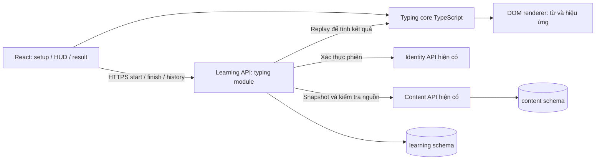
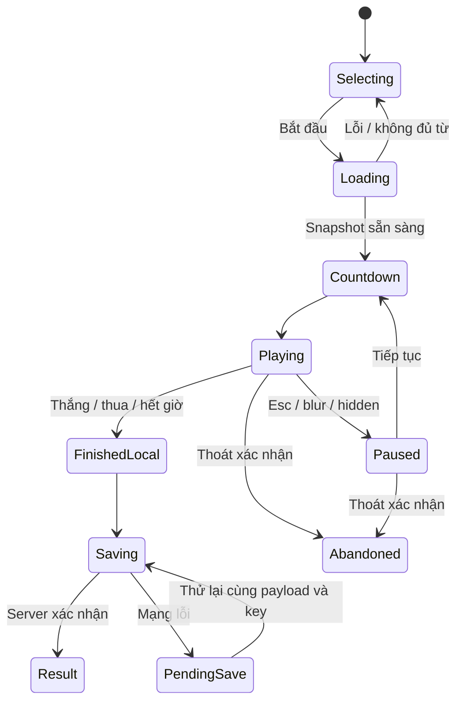

# Mini game luyện gõ tiếng Anh — System design và kế hoạch web

Ngày: 21/09/2026. Trạng thái: **đã triển khai bản web local trên branch `codex/typing-game-web`**. Đây là thiết kế gốc; các điều chỉnh thực tế và hướng dẫn chạy nằm trong [tài liệu triển khai](typing-game-web.md). Bằng chứng nghiệm thu được ghi riêng, không suy từ kế hoạch.

Quyết định đã được người dùng chọn: bản đầu **nhìn từ tiếng Anh rồi gõ lại**. Mục tiêu là luyện tốc độ nhận diện và chính tả trong một lượt chơi ngắn. Chế độ này không đủ để kết luận người học đã nhớ nghĩa từ.

## 1. Phân tích sản phẩm tham khảo

Đã mở [BaoLingo Typing Game](https://baolingo.app/vi/vocabulary/typing-game), chọn bộ HSK 1, bắt đầu game và kiểm tra tạm dừng trong trình duyệt ngày 21/09/2026.

Các yếu tố quan sát được: chọn bộ thẻ; từ rơi xuống vùng tàu; điểm, mốc và mạng; khóa mục tiêu bằng chữ đầu; độ khó tăng qua mốc. Giao diện còn có tạm dừng/tiếp tục, thoát, bật bàn phím, ẩn pinyin và âm thanh. Hướng dẫn công khai nêu 3 mạng và chia sẻ ảnh kết quả. Chưa xác minh công thức điểm, API, cơ sở dữ liệu, cơ chế lưu kết quả hoặc chống gian lận của BaoLingo. Thiết kế bên dưới là đề xuất cho Sprout, không phải mô tả backend của BaoLingo.

| Cơ chế tham khảo | Áp dụng vào Sprout |
|---|---|
| Chọn bộ thẻ | Chọn từ của một bài học hoặc thẻ cá nhân |
| Hán tự và pinyin | Hiển thị tiếng Anh; tô sáng phần đã gõ |
| Nhóm thẻ thành mốc | Chia danh sách được chọn thành đợt tối đa 10 từ |
| Từ rơi, gõ để bắn hạ | Giữ cơ chế; dùng nhận diện và màu sắc của Sprout |
| Kết thúc lượt | Điểm, độ chính xác, tốc độ, từ bỏ lỡ và chơi lại |

Không lấy nội dung, hình ảnh hay mã nguồn của BaoLingo. Dùng học liệu và đồ họa riêng của dự án.

## 2. Hiện trạng dự án và điểm tích hợp

Đối chiếu mã nguồn thực tế thay vì chỉ dựa vào các tài liệu phiên bản trước:

| Thành phần hiện có | Tận dụng / thay đổi dự kiến |
|---|---|
| `apps/web/src/main.tsx`: React, hash routes, bảo vệ phiên | Thêm mục Mini game và route lazy-loaded |
| `apps/web/src/api.ts`: HTTP client, retry với key trong bộ nhớ | Dùng giao thức hiện có; bổ sung lưu payload kết quả chờ gửi qua reload |
| `apps/web/src/navigation.ts`: `useUnsaved` | Cảnh báo rời lượt chơi hoặc bỏ kết quả chưa lưu |
| `services/content/src/app.ts`: catalog, lesson revisions, vocabulary snapshots | Thêm truy vấn bộ từ theo bài và endpoint snapshot hàng loạt |
| `services/learning/src/app.ts`: auth, request dedup, flashcards | Đăng ký module game; giữ kết quả trong schema Learning |
| `packages/backend/src/http.ts`: `protect`, `contentCall`, service token | Dùng xác thực và ranh giới service sẵn có |
| `packages/api-client`: client/type dùng cho mobile | Thêm DTO dùng chung; không bắt buộc đổi toàn bộ HTTP client web |
| PostgreSQL/Supabase: `content`, `learning`, `identity` | Thêm migration trong Learning; không tạo database/service mới |

Nguồn bài học phải lấy từ `content.lesson_revision_vocabulary.snapshot` của phiên bản đã xuất bản. Không lấy trực tiếp danh sách quản trị `vocabulary_entries`, vì có thể chứa từ chưa xuất bản và không gắn với bài đang được phép học.

Thẻ cá nhân nằm ở `learning.flashcards`, đã có word/meaning/example, soft delete và thông tin nguồn. Hiện chưa có khái niệm deck cá nhân độc lập: MVP dùng “Thẻ của tôi”, có thể lọc theo chủ đề hiện có; không dựng CMS bộ thẻ mới.

## 3. Phạm vi bản web đầu tiên

### Bao gồm

- Người đã đăng nhập chọn nguồn từ một bài đã xuất bản hoặc thẻ của mình.
- Chọn Dễ / Vừa / Khó, xem số từ đủ điều kiện, bấm bắt đầu.
- Chọn tối đa 30 mục; tối thiểu 5 từ hợp lệ, không đủ thì chỉ rõ lý do và hướng dẫn bổ sung.
- 3 mạng; tự khóa mục tiêu; phản hồi đúng/sai; combo; tăng độ khó theo đợt.
- Tạm dừng thủ công và khi chuyển tab/mất focus; bật/tắt hiệu ứng âm thanh.
- Kết quả và lịch sử riêng; chơi lại bộ hiện hành; luyện lại từ bỏ lỡ. Điều chỉnh khi triển khai: chế độ luyện lại cho phép 1–3 từ vì một lượt chỉ có 3 mạng; lượt thông thường vẫn cần ít nhất 5 từ.
- Desktop/laptop với bàn phím vật lý là phạm vi nghiệm thu chơi game. Web màn hình nhỏ vẫn xem được bộ từ và kết quả, hiển thị hướng dẫn dùng bàn phím vật lý.

### Sau MVP

- Gợi ý nghĩa tiếng Việt → gõ tiếng Anh, nghe → gõ, nhiều đáp án tương đương.
- Bàn phím cảm ứng được nghiệm thu trên điện thoại/tablet; app React Native.
- Bộ từ theo toàn chủ đề/lộ trình, bộ tự tạo có nhóm, guest demo, chia sẻ ảnh.
- Leaderboard, thi đấu, daily challenge, XP/phần thưởng.

Điểm game không cập nhật `lesson_progress`, `wrong_questions`, stage/due_at của SRS hoặc điểm quiz. Nút kết quả có thể dẫn tới màn hình thẻ và ôn tập hiện có. “Nhớ từ” chỉ được ghi nhận theo hành động ôn tập đang có quy tắc riêng.

## 4. UX và luật chơi đề xuất

Luồng: **Mini game → Chọn nguồn/độ khó → Tải lượt → Đếm ngược → Chơi → Kết quả → Chơi lại / Xem từ bỏ lỡ**.

Routes đề xuất:

- `#/games/typing`: hướng dẫn, chọn bài/thẻ, cấu hình và lịch sử gần đây.
- `#/games/typing/play/:id`: sân chơi đang chạy.
- `#/games/typing/result/:id`: kết quả đã lưu; kết quả chờ lưu hiển thị tại trang chơi.
- `#/games/typing/history`: lịch sử phân trang.

Layout desktop: phía trên là tên bộ, điểm, đợt, 3 mạng, Pause và Sound; giữa là vùng từ rơi có đường chạm đáy; dưới là mục tiêu đang khóa, phần đã gõ và hướng dẫn phím. Kết quả hiển thị rõ “Đang lưu”, “Đã lưu” hoặc “Chưa lưu — thử lại”.

### Nhập và khóa mục tiêu

1. Không có mục tiêu: ký tự đầu chọn từ đang rơi có tiền tố phù hợp; ưu tiên từ sắp chạm đáy nhất, hòa thì dùng thứ tự spawn.
2. Đã khóa: chỉ xử lý từ đó. Ký tự đúng tăng vị trí nhập; ký tự sai không thêm vào buffer, tăng lỗi và ngắt combo.
3. Gõ đủ chuỗi thì hạ mục tiêu; không cần Enter. Backspace lùi một ký tự, không hoàn tác lỗi đã tính. Buffer rỗng thì mở khóa.
4. Tab bỏ khóa/buffer khi sân chơi đang giữ focus; Esc tạm dừng và trả focus cho nút tiếp tục. Ngoài sân chơi, Tab hoạt động điều hướng bình thường.
5. Từ chạm đáy mất 1 mạng, ngắt combo và bỏ khóa nếu cần. Một từ chỉ gây mất mạng một lần.
6. Hết từ của một đợt và không còn mục tiêu đang rơi thì nghỉ 2 giây rồi sang đợt kế. Hết đợt cuối khi còn mạng thì thắng; hết mạng thì thua.

Chuẩn hóa `NFC`, lowercase, trim và gộp khoảng trắng; đổi dấu nháy cong thành `'`. Hỗ trợ chữ Latin a–z, khoảng trắng, apostrophe và hyphen; 2–40 ký tự sau chuẩn hóa. Có thể mở rộng whitelist sau khi rà học liệu. Cụm `operating system` phải gõ cả khoảng trắng; không tự bỏ dấu nối hoặc dấu nháy. Từ chứa ký tự ngoài phạm vi bị loại và có thống kê lý do.

Loại trùng theo chuỗi gõ chuẩn hóa; nếu có nhiều nghĩa thì lấy mục đầu theo thứ tự nguồn ổn định. Không cho hai mục tiêu cùng chuỗi xuất hiện trong một lượt. Khi nhiều từ có cùng chữ đầu, dùng quy tắc khóa nêu trên và đánh dấu mục tiêu thật rõ.

Chỉ nhận phím trong vùng chơi; bỏ qua tổ hợp Ctrl/Alt/Meta, key repeat, paste/drop và sự kiện đang composition. Cảnh báo chuyển bộ gõ sang English khi đang dùng IME; không tính composition là gõ sai. [KeyboardEvent.isComposing](https://developer.mozilla.org/en-US/docs/Web/API/KeyboardEvent/isComposing).

### Độ khó và điểm — thông số khởi đầu, cần playtest

| Tham số | Dễ | Vừa | Khó |
|---|---:|---:|---:|
| Thời gian rơi cơ sở | 14 giây | 11 giây | 8 giây |
| Khoảng spawn cơ sở | 3 giây | 2,4 giây | 1,8 giây |
| Số mục tiêu đồng thời tối đa | 3 | 4 | 6 |

Mỗi đợt giảm thời gian rơi/khoảng spawn theo hệ số 0,9, với sàn tương ứng 5 giây và 1 giây. Cộng 0,15 giây rơi cho mỗi ký tự vượt quá 8 ký tự, tối đa 4 giây. Mục tiêu dài vì vậy có thêm thời gian, nhưng không thay đổi tốc độ theo kích thước cửa sổ.

- Mỗi từ hoàn thành: `10 × số ký tự của đáp án + 5 × min(combo trước từ này, 10)`.
- Combo là số từ hoàn thành liên tiếp kể từ lỗi gõ hoặc từ rơi gần nhất. Backspace/đổi mục tiêu không cộng điểm; điểm chỉ cộng một lần lúc hạ từ.
- Accuracy = số ký tự được chấp nhận / tổng ký tự hợp lệ đã nhập × 100. Ký tự không khớp mục tiêu nào cũng tính là lỗi; phím điều khiển không vào mẫu số. Chưa nhập thì hiển thị “—”.
- WPM = tổng ký tự trong các từ đã hoàn thành / 5 / số phút chơi thực tế; không gồm pause, countdown và nghỉ giữa đợt. Đây là tốc độ trong game, không so sánh trực tiếp với bài đo gõ văn bản thông thường.
- Kết quả có số từ hạ được, số từ rơi, số từ chưa xuất hiện và mức hoàn thành. Không gộp từ chưa xuất hiện vào lỗi của người học.

Không so sánh kỷ lục giữa các độ khó hay danh sách từ khác nhau. MVP hiển thị lịch sử; kỷ lục chuẩn hóa theo bộ/version có thể làm sau.

## 5. Kiến trúc hệ thống



**Chọn game chạy tại client và REST khi bắt đầu/kết thúc.** Phản hồi bàn phím không chờ mạng. Không cần WebSocket, Redis, broker hoặc service thứ tư cho game một người. Khi bắt đầu, server cố định bộ từ, thứ tự, cấu hình và version luật; khi kết thúc, server tái chạy event log bằng cùng core và ghi kết quả.

### Core và renderer

- Tạo `packages/typing-core` không phụ thuộc React, DOM, audio, network hoặc thời gian hệ thống. Đầu vào là snapshot, cấu hình và events; đầu ra là trạng thái, hiệu ứng và kết quả.
- Các hàm chủ đạo: `createGame`, `advanceToTick`, `applyInput`, `getResult`, `replay`.
- Server tạo thứ tự và lane của từng từ; lưu manifest thay vì chỉ seed. Không phụ thuộc phiên bản random/shuffle sau khi tạo lượt.
- Logic dùng tick nguyên 20 ms và deadline nguyên. Ở mỗi tick: xử lý từ hết hạn → chuyển đợt/spawn → inputs theo `seq`. Gõ đúng đúng tick hết hạn vẫn tính từ đã rơi; UI dùng cùng quy tắc.
- Spawn bị chặn khi đạt số mục tiêu tối đa; thử lại theo tick và không spawn dồn bù sau pause. Cùng snapshot/events phải cho cùng kết quả.
- Web vẽ bằng DOM elements + CSS transform, cập nhật vị trí qua refs trong `requestAnimationFrame`. Tối đa 6 mục tiêu nên chưa cần Canvas/Phaser; React chỉ cập nhật khi nội dung/HUD thay đổi, không `setState` toàn trang mỗi frame.
- Dùng thời gian timestamp để tính tiến trình thay vì đếm frame; màn hình 60/120/144 Hz không được làm game chạy khác tốc độ. [requestAnimationFrame](https://developer.mozilla.org/en-US/docs/Web/API/Window/requestAnimationFrame).
- Tọa độ logic chuẩn hóa theo lane và thời gian rơi; resize chỉ đổi cách vẽ. Tránh chồng nhãn bằng kiểm tra lane/chiều rộng, dùng tối đa hai dòng cho cụm từ dài.
- `visibilitychange`/blur tự pause; quay lại phải bấm tiếp tục, không cộng khoảng thời gian ở nền vào mô phỏng. Khi main thread bị treo lâu, pause và đặt lại mốc renderer thay vì chạy bù làm mất cả 3 mạng. [Page Visibility API](https://developer.mozilla.org/en-US/docs/Web/API/Page_Visibility_API).
- Âm thanh mở sau thao tác Bắt đầu, lỗi audio không chặn game. Reduced motion tắt rung/particle; dùng chữ/icon ngoài màu để phản hồi đúng/sai. HUD và nút thao tác là HTML có nhãn; không tuyên bố game thời gian thực đã hỗ trợ đầy đủ screen reader trước khi nghiệm thu.

State client:



## 6. Thiết kế dữ liệu

Hai bảng mới, FK chỉ trong Learning. UUID bài/từ/phiên bản là tham chiếu logic sang Content, theo kiến trúc đang có.

### `learning.typing_game_sessions`

| Nhóm | Cột dự kiến |
|---|---|
| Chủ sở hữu | `id`, `user_id`, `created_at`, `row_version` |
| Nguồn | `source_kind` (lesson/personal_cards/retry_missed), `source_ref_id` nullable, `source_title_snapshot` |
| Luật | `mode` = copy, `difficulty`, `rules_version`, `normalization_version`, `config_snapshot`, `manifest_hash` |
| Vòng đời | `status` (in_progress/completed/abandoned/expired), `expires_at`, `finished_at`, `outcome` nullable (won/lost/time_limit) |
| Kết quả | `score`, `correct_keys`, `typed_keys`, `active_ms`, `max_combo`, `destroyed_count`, `missed_count`, `result` JSONB |
| Nộp lượt | `submission_hash`, `event_log` JSONB nullable, `final_tick` nullable |

Lượt còn sống chưa có điểm chính thức; completed bắt buộc có outcome và result; abandoned/expired không có điểm được công nhận. Snapshot/config/source/version bất biến; kết quả và event log chỉ được ghi trong chuyển trạng thái cuối, sau đó bất biến.

### `learning.typing_game_items`

`id`, `session_id`, `user_id`, `position`, `wave`, `lane`, `source_kind`, `source_item_id`, `source_lesson_id` nullable, `source_revision_id` nullable, `word_snapshot`, `meaning_snapshot`, `example_snapshot`, `normalized_answer`, `fall_duration_ticks`.

FK `(user_id, session_id)` → sessions; unique `(session_id, position)` và `(session_id, normalized_answer)`. Items được tạo cùng transaction với session và bất biến sau đó. Không cần FK tới flashcard: xóa/sửa thẻ không làm thay đổi lịch sử.

Indexes: `(user_id, created_at DESC, id)`, `(user_id, status, expires_at)`; unique có điều kiện một `in_progress`/user. Trước khi tạo lượt, khóa theo user và expire các lượt quá hạn để không bị kẹt bởi unique index.

Bật RLS và cấp quyền rõ cho `app_learning_runtime` theo mẫu dự án; thu hồi quyền trực tiếp của anon/authenticated. Policy runtime hiện có không phân tách từng user, nên **mọi truy vấn API vẫn bắt buộc lọc owner**, kể cả items và replay lượt cũ. Không coi bật RLS là đủ để chống đọc chéo tài khoản.

Không thêm bảng tổng điểm, leaderboard, inventory hoặc game achievements. Có thể tính lịch sử từ sessions. Event log giới hạn kích thước; không log raw keys ra application log. Đề xuất giữ log replay 30 ngày, sau đó job quản trị xóa log theo chính sách đã chốt, giữ summary/items; job này không nằm trên đường xử lý input.

## 7. API contract đề xuất

Tất cả public endpoint game yêu cầu phiên hợp lệ; user_id lấy từ Identity, không nhận từ body.

| Service | Endpoint mới | Chức năng |
|---|---|---|
| Content | `GET /v1/typing-sources?page=1` | Các bài published có từ hợp lệ, count và title; lọc course/topic tùy chọn |
| Content, internal | `POST /internal/typing-snapshot` | Kiểm tra nguồn, lấy snapshot cả bộ trong một lần; có giới hạn số từ |
| Learning | `GET /v1/typing-sources/personal` | Count hợp lệ, tổng thẻ bị loại; lọc topic tùy chọn |
| Learning | `POST /v1/typing-sessions` | Tạo snapshot, cấu hình, items và thời hạn |
| Learning | `GET /v1/typing-sessions/:id` | Trạng thái; manifest nếu đang chơi, kết quả nếu đã kết thúc |
| Learning | `POST /v1/typing-sessions/:id/finish` | Validate, replay, lưu kết quả trong transaction |
| Learning | `POST /v1/typing-sessions/:id/abandon` | Kết thúc không tính điểm |
| Learning | `GET /v1/typing-sessions?page=1` | Lịch sử của chính người dùng, 20 dòng/trang |

Body tạo lượt ví dụ (giá trị UUID là placeholder):

```json
{
  "source": { "kind": "lesson", "lesson_id": "<uuid>" },
  "difficulty": "normal",
  "limit": 30
}
```

Nguồn khác: `{ "kind": "personal_cards", "topic_id": "<uuid optional>" }` hoặc `{ "kind": "retry_missed", "session_id": "<uuid>" }`. Server sở hữu cách chọn từ; không nhận một danh sách đáp án tùy ý từ browser.

Response start gồm `session_id`, `expires_at`, `rules_version`, `normalization_version`, `config`, `manifest_hash`, `items`. Canonical answer được gửi cho client vì đây là game chép từ và xử lý input tại chỗ; không tái sử dụng endpoint key của quiz/Dictation.

Body finish gồm `manifest_hash`, `final_tick`, `events: [{seq, tick, type, value?}]`. Types v1: `char`, `backspace`, `unlock`; không nhận sự kiện “tôi đã hạ từ” hoặc điểm tự khai. Tick không gồm thời gian pause/countdown nhưng gồm khoảng nghỉ giữa đợt; core tính riêng `active_ms` để tính tốc độ.

Các POST yêu cầu `Idempotency-Key`. Dùng `learning.claim_request`/`finish_request` hiện có; cùng key khác body phải bị từ chối. Finish khóa row session: gửi lại cùng submission trả kết quả cũ, kể cả response trước đó bị mất; payload khác sau completed trả `409 SESSION_ALREADY_FINISHED`.

Lỗi nghiệp vụ: `INSUFFICIENT_WORDS` 409, `CONTENT_UNAVAILABLE` 409, `ACTIVE_GAME_EXISTS` 409 kèm ID của lượt thuộc user, `SESSION_EXPIRED` 409, `INVALID_GAME_LOG` 422, `SESSION_NOT_FOUND` 404. Lỗi body vượt giới hạn 413. UI không tự retry vô hạn các lỗi nghiệp vụ.

### Quy tắc nguồn và retry

- Tạo lượt từ bài: bài/chủ đề/lộ trình đều phải đang published; snapshot từ đúng revision. Không gọi Content một lần cho mỗi từ.
- Tạo lượt từ thẻ: chỉ thẻ owner, chưa soft-delete; chụp giá trị thẻ mà người dùng đã chỉnh. Thẻ có nguồn bài vẫn theo chính sách thẻ cá nhân hiện hành.
- Bài sửa revision khi đang chơi: lượt tiếp tục dùng snapshot cũ. Bài bị ẩn: chặn lượt mới; lượt đang có vẫn hoàn tất như hoạt động cá nhân và không cấp XP. Đây là chính sách riêng được đề xuất cho game, cần ghi rõ thay vì vô tình kế thừa quy tắc cancel của quiz.
- Luyện lại từ rơi: đọc kết quả server của phiên thuộc owner, kiểm tra lại nguồn hiện hành và quyền, bỏ mục không còn khả dụng, tạo session mới. Không nhận missed_ids từ client làm sự thật. Điều chỉnh khi triển khai: cho phép 1–3 từ trong chế độ này; không còn từ khả dụng thì hướng dẫn chọn nguồn khác.

## 8. Lưu kết quả, lỗi mạng và tính tin cậy

Server replay xác minh trình tự và tính lại điểm; điều này **không chứng minh người thật đã gõ**. Client vẫn biết đáp án và có thể tạo log hợp lệ bằng script. MVP là luyện cá nhân, không dùng điểm này cho phần thưởng hay xếp hạng cạnh tranh.

Giới hạn đề xuất: 30 mục/lượt, 10.000 events, request finish tối đa 512 KiB, tối đa 10 phút thời gian mô phỏng, session hết hạn sau 30 phút giờ server. Event tick/seq phải hợp lệ, tăng không lùi, trong giới hạn và không kéo dài quá terminal state. Core phải đi đến won/lost/time_limit mới được finish. Server kiểm tra mô phỏng không dài hơn thời gian thực từ khi tạo lượt cộng sai số nhỏ; kiểm tra này chỉ phát hiện bất hợp lý cơ bản.

- Lưu pending finish vào IndexedDB theo user/session trước khi gửi, gồm key và payload nguyên vẹn. Chỉ xóa sau khi server xác nhận; quota/private-mode lỗi phải hiển thị rằng kết quả chỉ còn trong bộ nhớ.
- Khi mạng mất giữa game: tiếp tục với snapshot; tới kết quả hiển thị pending. Chỉ lưu được nếu gửi trước hạn. Quá hạn vẫn có thể xem kết quả cục bộ nhưng không chuyển thành kết quả được server công nhận.
- Reload giữa lượt: MVP không resume vị trí rơi. GET session, hiển thị “Lượt trước bị gián đoạn”, cho hủy để chơi lượt mới. Pending finish đã có thì retry, không hủy nó nhầm thành lượt gián đoạn.
- Token refresh cùng user không remount game. Đổi user/logout thì dừng game và xóa dữ liệu riêng trong bộ nhớ/cache theo chính sách logout; tuyệt đối không gửi pending của A bằng tài khoản B.
- Hai tab cùng session: Web Locks nếu có/BroadcastChannel hỗ trợ chỉ một tab điều khiển; server vẫn là bảo vệ cuối bằng row lock, status và submission hash. Tab thua tranh chấp tải kết quả đã lưu, không ghi đè.
- Abandon lỗi mạng: vẫn thoát UI theo lựa chọn người dùng; lần mở sau xử lý lượt còn sống hoặc hết hạn. Không dựa vào `beforeunload` để bảo đảm request đã tới server.
- Validation/replay ngoài transaction dài; lấy snapshot bất biến, kiểm tra lại ownership/status/hash/expiry bên trong transaction ngắn trước commit. Không giữ connection/row lock trong lúc gọi Content/Identity.

Khi cần leaderboard: phải thiết kế riêng bộ từ/luật cố định, challenge do server phát, rate limit dùng chung giữa instance và phát hiện bất thường; replay phía server một mình chưa đủ.

## 9. Cấu trúc mã dự kiến

```text
packages/typing-core/src/
  types.ts          normalize.ts      rules.ts
  engine.ts         replay.ts         index.ts
apps/web/src/games/typing/
  index.tsx         Setup.tsx         Play.tsx
  Result.tsx        History.tsx       useTypingGame.ts
  renderer.ts       input.ts          pending-result.ts
  typing.css
services/content/src/typing.ts
services/learning/src/typing.ts
supabase/migrations/<timestamp>_typing_game.sql
tests/typing-core/*.test.ts
tests/typing-api.test.mjs
tests/web/typing-game.spec.ts
```

Đăng ký route trong hai `app.ts`, thêm route/menu ở `main.tsx`, DTO trong `packages/api-client/src/types.ts` và contract snapshot trong `packages/backend/src/contracts.ts`. Thêm workspace/package build exports cho core: browser resolve được khi Vite build, backend Node chạy JavaScript đã build, không dựa vào việc Node tự chạy source TypeScript. Xác minh cả hai đường build ở phase 1.

Không chỉnh implementation mobile ở giai đoạn này. Sau web, mobile dùng cùng core và API, thay renderer/input/lifecycle; không coi việc chia sẻ core là đã giải quyết bàn phím cảm ứng.

## 10. Kế hoạch triển khai và mốc nghiệm thu

Ước lượng **10–13 ngày công cho một lập trình viên full-stack quen repo**, gồm test và sửa lỗi; không phải lịch cam kết. Chưa gồm mobile, leaderboard, biên soạn học liệu lớn hoặc triển khai hạ tầng public mới.

| Giai đoạn | Ngày công | Công việc | Điều kiện hoàn thành |
|---|---:|---|---|
| 0. Chốt luật và học liệu | 0,5–1 | Rà từ thực tế; fixture đủ 3 đợt; wireframe; chốt normalize/input/score | Có bộ 30 từ chơi được, gồm cụm từ và dấu nháy/nối |
| 1. Core và prototype web | 2–2,5 | Engine thuần, render/input, pause, difficulty, unit test, workspace/build | Chơi thắng/thua được với fixture; replay cho kết quả giống hệt |
| 2. Database và API | 2–2,5 | Migration, snapshot batch, auth, start/finish/abandon/history, idempotency | HTTP và DB tests đạt, chặn đọc chéo và nộp trùng |
| 3. Nối UX thật | 2 | Setup từ bài/thẻ, routes/menu, kết quả, history, retry từ bỏ lỡ, pending finish | Một lượt thật từ đầu tới lịch sử; reload kết quả vẫn đúng |
| 4. Khả năng phục hồi và QA | 2–3 | Mạng/token/multi-tab/focus/IME, âm thanh, responsive, performance, E2E | Các tình huống lỗi và tiêu chí bên dưới đạt |
| 5. Phát hành thử | 1 | Feature flag, staging migration, playtest, tài liệu vận hành và rollback | Có bằng chứng test, feedback, kiểm tra dữ liệu cũ không bị ảnh hưởng |

Phụ thuộc chính: 0 → 1 → 2 → 3 → 4 → 5. Có thể soạn migration/API sau khi contract ở phase 1 ổn định; ưu tiên demo engine sớm để kiểm tra cảm giác gõ trước khi hoàn thiện lưu kết quả.

### Các kiểm thử bắt buộc

**Core:** từ cùng prefix; từ lặp sau normalize; space/apostrophe/hyphen; sai rồi sửa; từ rơi khi đang khóa; input đúng tick deadline; mất nhiều mạng cùng tick; chuyển đợt; kết quả không phụ thuộc frame rate; replay cùng manifest/events phải bằng kết quả live.

**API/database:** không có auth; owner khác; bài nháp/ẩn; thẻ người khác/đã xóa; không đủ từ; input vượt giới hạn; log sửa tick/seq/hash; finish trước terminal; retry sau response mất; hai finish đồng thời; finish đối đầu abandon; unique lượt đang chạy; expiry không chặn tạo mới; snapshot không đổi theo sửa thẻ/bài; runtime role không truy cập chéo schema.

**Web E2E:** chọn nguồn → đếm ngược → gõ → kết quả → reload lịch sử; pause/blur/ẩn tab; hotkey không chặn form/menu; token refresh không reset; mất mạng lúc finish và retry sau reload; đổi tài khoản; hai tab; hủy rời trang; âm thanh bị chặn; cụm dài không tràn màn hình. Fixture/clock ổn định, không dùng sleep dài hoặc FPS thật để quyết định pass/fail.

**Mục tiêu hiệu năng để đo, chưa phải kết quả đã đạt:** ở viewport từ 1024×768 với 6 mục tiêu, desktop phổ thông đạt khoảng 60 FPS; input-to-highlight p95 dưới 50 ms. Với dữ liệu 30 từ, start p95 dưới 1 giây, finish p95 dưới 1,5 giây trong môi trường staging và kịch bản tải 20 lượt đồng thời; ghi rõ máy, network và tải khi báo cáo. Giới hạn worker/request concurrency nếu replay gây nghẽn; đo trước khi cần thêm hạ tầng.

Kiểm tra theo phạm vi: core unit → `npm run typecheck`, `npm run web:typecheck` và build → DB/API game mới → Playwright game và session regression → backend/database/expansion regressions liên quan. Migration phải kiểm tra cả nâng cấp có dữ liệu và dựng sạch; không reset DB người dùng để kiểm thử.

## 11. Phát hành, theo dõi và quyết định thiết kế

- Flag phía web để ẩn/hiện entry game; flag backend chặn tạo lượt mới nhưng cho finish/history trong cửa sổ chuyển đổi. Không chỉ giấu menu để tắt tính năng.
- Deploy additive migration trước, backend hỗ trợ contract v1 tiếp theo, frontend sau cùng. Giữ khả năng replay rules_version cũ ít nhất hết TTL của lượt sống và cửa sổ retry.
- Rollback bằng tắt start mới và quay lại frontend/backend tương thích; không drop bảng lịch sử. Ghi rõ bước migrate/build/restart như các tính năng hiện có.
- Theo dõi số start, completed/abandoned/expired, completion rate, thời lượng, tỷ lệ từ rơi, finish latency và lỗi lưu theo request ID. Không thêm raw keys hoặc đáp án người dùng vào log chung.
- Dữ liệu thử để playtest phải lấy từ học liệu được phép dùng và không lẫn fixture rỗng. Từ dài, viết tắt kỹ thuật và cụm nhiều từ cần kiểm tra riêng.

Các quyết định của bản đề xuất: copy tiếng Anh; web desktop trước; một bài hoặc thẻ cá nhân; 3 mạng; tối đa 30 từ; DOM renderer và TypeScript core; Learning module + PostgreSQL; server tính lại điểm; lịch sử cá nhân; điểm game độc lập với SRS/quiz. Bước triển khai đầu tiên là phase 0–1 để có vòng chơi hoàn chỉnh, sau đó nối dữ liệu và lưu kết quả theo contract trên.
